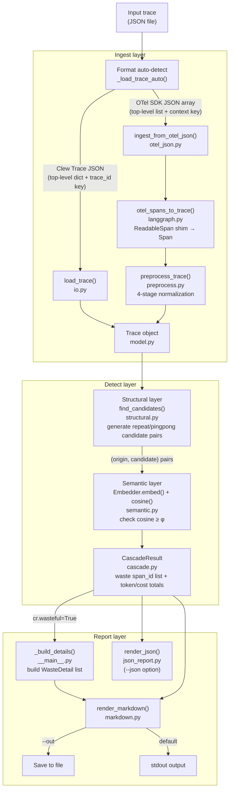
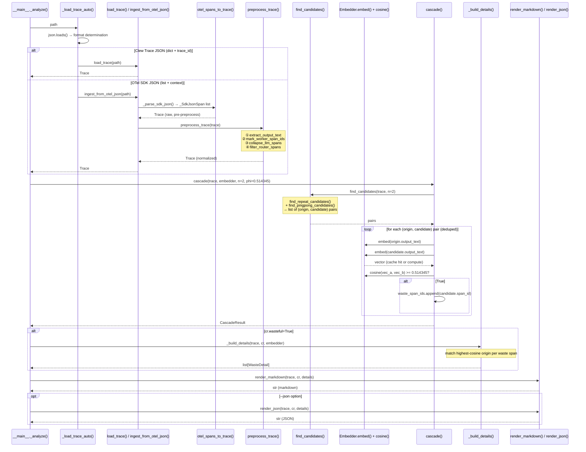

# Clew Architecture Document

> Written: 2026-06-30. Based on direct reading of the codebase under `src/clew/`.
> Inferences marked [inference]; unverified items marked [unverified]. Everything else is a
> value directly confirmed from code, commits, or validation documents.

---

## PART 1. Concept

### 1.1 One-Line Definition

**Clew** is a tool that takes execution traces from multi-agent AI systems and reports the
tokens and cost wasted when agents repeat the same work.

#### Background

Failures in multi-agent systems often are not "the model is dumb" but **structural problems
between agents** — the same node executing over and over, two agents pingponging by
re-asking each other, or re-querying information that was already retrieved. That waste is
**token cost**, and existing observability tools are built around one agent at a time, so
they cannot see this "between" layer.

Clew (from Ariadne's ball of thread — the etymological root of the English word "clue")
makes that waste visible. The company name Custos is Latin for "guardian, watchman."

---

### 1.2 5-Minute Non-Technical Summary

**Analogy: a logistics-warehouse security camera**

Imagine you install cameras in a package warehouse. The footage catches one worker pulling
the same box off a shelf, putting it back, pulling it off again, and putting it back again.
Or a scene where team A asks team B "is this address right?", team B asks team A back,
and the loop repeats. Clew does exactly that.

**Input:** the full record of AI agents talking to each other and using tools (a single
trace file, in JSON).

**Processing:**
1. **Cleanup** — extract the essentials from the record. Internal intermediate rows and
   "pass-through nodes" are removed; only records of the agents that actually did the work
   are kept.
2. **Structural check** — determine whether the same agent shows up more than once, whether
   there is an A→B→A→B pattern, or whether the same query was searched twice — and build a
   "suspects list."
3. **Content check** — for each pair on the suspects list, verify that the two records
   actually produced similar content (same result in different words → waste).
4. **Cost calculation** — sum the tokens and estimated cost of the records confirmed as
   waste.

**Output:** a report like "in this trace, the `researcher` node executed twice, and the two
outputs are 92% similar. Estimated wasted tokens: 240."

**Honest limits at the current stage (S0):** the similarity threshold used in the "content
check" step (φ=0.514345) was tuned on synthetic traces. When we ran 5 real traces, even
non-waste pairs had similarity higher than the threshold. So false positives can happen in
real environments. See Part 3 for details.

---

### 1.3 Big-Picture Architecture

> The diagram below follows the actual call order of `__main__._analyze()` (`:92`).



**One-line responsibility per box:**

| Box | File | Responsibility |
|-----|------|----------------|
| `_load_trace_auto()` | `__main__.py:17` | Auto-detect format, dispatch to appropriate loader |
| `load_trace()` | `io.py:18` | Clew Trace JSON → `Trace` (pydantic deserialization) |
| `ingest_from_otel_json()` | `otel_json.py:110` | OTel SDK JSON file → `_SdkJsonSpan` shim → delegate to ingest path |
| `otel_spans_to_trace()` | `langgraph.py:78` | OTel ReadableSpan interface → canonical `Trace` (conversion only, no preprocessing) |
| `preprocess_trace()` | `preprocess.py:170` | 4-stage normalization pipeline (JSON extract · worker mark · LLM collapse · router filter) |
| `find_candidates()` | `structural.py:71` | Generate repeat/pingpong candidate pairs from time-ordered span sequence (labels not referenced) |
| `Embedder` + `cosine()` | `semantic.py:54, 91` | Local multilingual embedding + cosine similarity, SQLite cache |
| `cascade()` | `cascade.py:29` | Combine structural candidates × semantic gate → `CascadeResult` |
| `_build_details()` | `__main__.py:72` | Per waste span, match to highest-similarity origin → `WasteDetail` list |
| `render_markdown()` | `report/markdown.py:18` | Human-readable markdown report string |
| `render_json()` | `report/json_report.py:19` | Machine-readable JSON report string |

---

### 1.4 Core Design Decisions and Their Reasoning

#### Decision 1: structural layer → semantic layer order (cascade)

Define "waste = structural candidate **AND** cosine ≥ φ" (`cascade.py:4`).

- **Structural only:** legitimate repeats (using the same tool twice on different subjects)
  would also become candidates, producing many false positives.
- **Semantic only:** you would have to embed all O(n²) span pairs, which is expensive and
  provides no scoping for what to compare.
- **Why this order:** the structural layer narrows the candidates first (the input gate
  removes unnecessary pairs), and the semantic layer only checks those candidates.
  Grounded in `SPEC.md §8.3`.

#### Decision 2: input gate on tool spans

In `find_repeat_candidates()` (`structural.py:46`), a re-occurring `span_kind == "tool"`
span is admitted as a candidate only when its `input_text` matches the first occurrence
under normalization (`strip().casefold()`).

Reason: calling the same tool twice with different queries is legitimate work. This gate is
the core detection path for the `requery_known` pattern.

#### Decision 3: no input gate on llm and chain spans

`find_pingpong_candidates()` (`structural.py:52`) comment: "pingpong nodes are kind=='llm',
so they are not subject to the input gate (SPEC §8 2.1)." For llm spans, even with
different inputs, similar outputs can indicate waste.

#### Decision 4: regen_handoff is out of v1 scope

`CRITERIA_FROZEN.md:74–78` states: "structural gap (find_candidates candidates = 0;
cross-node A→B appears once each). cosine(A,B)=0.862 > φ — not a semantic miss but a
purely structural non-coverage." When A generates content and B regenerates it, A and B
each appear only once, so the repeat threshold (N=2) is not met, and it is also not a
pingpong, so the structural layer yields zero candidates. Semantic-layer-only detection
carries too much false-positive risk, so v1 explicitly excludes it.

#### Decision 5: local embedding model, not an API

`semantic.py:82–88`: `SentenceTransformer` runs locally. Reasons: (a) deterministic
behavior enforceable (torch seed 0), (b) no API key required, (c) works offline, (d)
cache prevents recomputing identical text.

#### Decision 6: validation-honesty design (core)

Principles specified in `CLAUDE.md §4` and `CRITERIA_FROZEN.md`:
- Detection code (`src/clew/`) never references labels (`eval/labels.jsonl`) — enforced by
  11 leak-guard tests.
- φ·N is determined on the dev set (seed=7) only; the eval set (seed=42) is measured
  exactly once.
- No threshold changes after the fact.
- "It was built" ≠ "there is signal." The MVP's first mission is to confirm the detector
  catches real waste.

---

## PART 2. Code-Level Detail

### 2.1 Directory Structure

```
Custos - clwe project/
├── src/clew/                          # package root (name="clew", version="0.1.0")
│   ├── __init__.py                    # __version__ = "0.1.0"
│   ├── __main__.py                    # CLI entry point (python -m clew)
│   ├── model.py                       # canonical data model (Span, SpanNode, Trace)
│   ├── io.py                          # Trace ↔ JSON file serialization
│   ├── capture.py                     # LangGraph app-run + OTel capture helper
│   ├── ingest/
│   │   ├── __init__.py
│   │   ├── langgraph.py               # OTel ReadableSpan → Trace (official ingest path)
│   │   ├── otel_json.py               # OTel SDK JSON file → Trace (Format A)
│   │   └── preprocess.py              # 4-stage preprocessing pipeline
│   ├── detect/
│   │   ├── __init__.py
│   │   ├── structural.py              # structural candidate detection (labels not referenced)
│   │   ├── semantic.py                # cosine similarity + Embedder + SQLite cache
│   │   └── cascade.py                 # structural+semantic combination → CascadeResult
│   └── report/
│       ├── __init__.py
│       ├── _model.py                  # WasteDetail dataclass
│       ├── markdown.py                # human-readable markdown report
│       └── json_report.py             # machine-readable JSON report
│
├── tests/                             # 171 tests total (pytest, 16 files)
│   ├── conftest.py
│   ├── test_model.py                  # Span/Trace validation rules (16)
│   ├── test_structural.py             # structural candidate detection (15)
│   ├── test_cascade.py                # cascade combination (7)
│   ├── test_semantic_determinism.py   # embedding determinism (10)
│   ├── test_calibrate.py              # calibration (15)
│   ├── test_langgraph_adapter.py      # OTel adapter (10)
│   ├── test_otel_json_ingest.py       # OTel SDK JSON ingest (13)
│   ├── test_generator.py              # pattern generators (36)
│   ├── test_no_label_leakage.py       # leak guards (11) ★
│   ├── test_build_set.py              # eval set generation (8)
│   ├── test_build_set_regression.py   # set-generation regression (2)
│   ├── test_evaluate_reproducible.py  # F1/FPR reproducibility (6)
│   ├── test_roundtrip.py              # save/load roundtrip (8)
│   ├── test_field_regressions.py      # real-trace scenarios (6)
│   ├── test_report_cli.py             # CLI analyze+report (3)
│   └── test_dod.py                    # stage-boundary DoD (5)
│
├── eval/                              # validation set (fully separated from src/clew/)
│   ├── labels.jsonl                   # seed=42, positive 40 / negative 40
│   ├── set_manifest.json              # sha256 frozen
│   ├── traces/                        # 80 eval traces
│   ├── dev/seed-7/                    # dev traces for calibration
│   ├── evaluate.py                    # compare against labels (only place src/clew is accessed here)
│   ├── calibrate.py                   # decides φ·N (reads dev set only)
│   └── generators/
│       ├── build_set.py
│       └── patterns/                  # repeat_node, pingpong_aba, requery_known, regen_handoff
│
├── field_test/                        # real-trace experiments (Claude Haiku 3-node LangGraph)
│   ├── REAL_PROBE_LOG.md              # E1-E3 pre-registered results
│   └── real_*.json / d5_*.md          # per-scenario traces and analyses
│
├── validation/
│   ├── CRITERIA_FROZEN.md             # frozen go/no-go criteria ★
│   ├── CALIBRATION_LOG.md
│   └── EVAL_RUNS.md
│
├── examples/
│   ├── sample_otel_trace.json         # runnable 5-span example
│   └── README.md                      # export snippets per framework
│
├── SPEC.md                            # stage-by-stage detailed build spec
├── CLAUDE.md                          # standing context for Claude Code sessions
├── pyproject.toml                     # package settings
└── tasks.py                           # invoke-based build/test tasks
```

---

### 2.2 Per-Module Detail

#### 2.2.1 `src/clew/model.py` — Canonical Data Model

**Responsibility:** represent OTel/OpenInference spans in Clew's canonical internal form.
Pydantic v2 based. The input type for every downstream module.

**Main type alias:**
```python
# model.py:19
SpanKind = Literal["llm", "tool", "chain", "agent"]
```

**`Span` class** (`model.py:22–70`, Pydantic v2 `BaseModel`):
```python
class Span(BaseModel):
    trace_id: str
    span_id: str
    parent_span_id: str | None
    agent_or_node_id: str
    span_kind: SpanKind
    start_time: datetime            # tz-aware UTC enforced
    end_time: datetime              # tz-aware UTC, >= start_time enforced
    input_text: str
    output_text: str                # empty after strip() → ValueError
    token_count: int | None = None  # >= 0 enforced
    model: str | None = None
    cost_rate: float | None = None  # >= 0 enforced
```

Validation rules (field/model validators):
- `output_text`: empty string after strip → ValueError (`model.py:40–43`)
- `start_time`, `end_time`: tzinfo None → ValueError (`model.py:46–50`)
- `token_count`: < 0 → ValueError (`model.py:53–57`)
- `cost_rate`: < 0 → ValueError (`model.py:59–63`)
- `end_time < start_time` → ValueError (`model.py:66–70`)

**`SpanNode` class** (`model.py:73–78`):
```python
class SpanNode(BaseModel):
    span: Span
    children: list[SpanNode] = Field(default_factory=list)
```

**`Trace` class** (`model.py:83–150`):
```python
class Trace(BaseModel):
    trace_id: str
    spans: list[Span]
    metadata: dict[str, Any] = Field(default_factory=dict)
```

Invariants enforced by the `_validate_tree` model validator (`model.py:90–127`):
1. `spans` is non-empty
2. every span's `trace_id` matches `Trace.trace_id`
3. no duplicate `span_id`
4. exactly one root (`parent_span_id=None`)
5. no orphans (every `parent_span_id` refers to an existing `span_id`)
6. no cycles in the parent chain

`build_tree() -> SpanNode` (`model.py:129–150`): returns a recursive tree with children
sorted by `start_time` ascending.

---

#### 2.2.2 `src/clew/io.py` — Serialization

```python
# io.py:13
def save_trace(trace: Trace, path: Path) -> None
    # Trace.model_dump_json(indent=2), UTF-8 save

# io.py:18
def load_trace(path: Path) -> Trace
    # Trace.model_validate_json() deserialization
    # Raises: ValueError (parse failure or schema mismatch)
```

---

#### 2.2.3 `src/clew/ingest/langgraph.py` — OTel Adapter (Official Ingest Path)

**Responsibility:** list of OTel `ReadableSpan` objects → canonical `Trace`.
Framework-agnostic (LangGraph is only an example).

**Span-kind mapping** (`langgraph.py:32–38`):
```python
_KIND_MAP = {
    "LLM": "llm",
    "TOOL": "tool",
    "CHAIN": "chain",
    "RUNNABLE": "chain",
    "AGENT": "agent",
}
# other openinference.span.kind values → "chain" (langgraph.py:64–65)
```

**Main functions:**
```python
# langgraph.py:78
def otel_spans_to_trace(
    spans: Sequence[ReadableSpan],
    *,
    cost_table: dict[str, float] | None = None,
    source_tag: str = "otel_adapter",
) -> Trace
# Conversion only. Does not call preprocess_trace. Test/debug use only.
# Raises: ValueError (empty spans / multiple trace_ids / multiple roots / empty output.value)

# langgraph.py:148
def ingest_otel_spans(
    spans: Sequence[ReadableSpan],
    *,
    cost_table: dict[str, float] | None = None,
    source_tag: str = "otel_adapter",
) -> Trace
# Official ingest path = otel_spans_to_trace() + preprocess_trace()
# Production/field usage must go through this function.
```

Internal helpers (all deterministic):
- `_hex_trace(int_id: int) -> str` — 32-char hex (`langgraph.py:41`)
- `_hex_span(int_id: int) -> str` — 16-char hex (`langgraph.py:45`)
- `_ns_to_utc(ns: int) -> datetime` — nanoseconds → UTC datetime (`langgraph.py:49`)
- `_kind_of(attrs) -> SpanKind` — `openinference.span.kind` attribute → `SpanKind` (`langgraph.py:61`)
- `_token_count_of(attrs)` — extract `llm.token_count.total` (`langgraph.py:68`)
- `_model_of(attrs)` — extract `llm.model_name` or `llm.provider` (`langgraph.py:73`)

---

#### 2.2.4 `src/clew/ingest/otel_json.py` — OTel SDK JSON File Ingest

**Responsibility:** `span.to_json()` array file (Format A) → `Trace`. Delegates to
`ingest_otel_spans()` so `preprocess_trace` runs exactly once.

```python
# otel_json.py:110
def ingest_from_otel_json(
    path: Path,
    *,
    cost_table: dict[str, float] | None = None,
) -> Trace
# Format A JSON file → _parse_sdk_json() → _SdkJsonSpan shim → ingest_otel_spans()
# On detecting OTLP proto-JSON (resource_spans key), raises ValueError with a conversion hint
# Raises: ValueError (empty file, malformed shape, span without output.value)
```

`_SdkJsonSpan` (`otel_json.py:51`): a lightweight shim wrapping a `span.to_json()` dict in
the `ReadableSpan` interface. Implements only the fields accessed by
`otel_spans_to_trace()` (`.context.trace_id`, `.context.span_id`, `.parent.span_id`,
`.name`, `.start_time`, `.end_time`, `.attributes`).

---

#### 2.2.5 `src/clew/ingest/preprocess.py` — 4-Stage Preprocessing Pipeline

**Responsibility:** normalize the trace right after `otel_spans_to_trace()`, before
detection. Order matters (spelled out at `preprocess.py:178`).

```python
# preprocess.py:170
def preprocess_trace(trace: Trace) -> Trace
# ① extract_output_text — strip JSON scaffolding
# ② mark_worker_span_ids — compute the worker set before collapse
# ③ collapse_llm_spans — remove llm + token rollup + ReAct re-parent
# ④ filter_router_spans — remove router chain spans
# Records collapsed_llm_spans, filtered_router_spans in metadata
```

Each stage:
```python
# preprocess.py:22
def extract_output_text(raw: str) -> str
# JSON → recursive str-leaf collection → returns the longest non-empty
# If JSON parse fails or no leaf is found, returns the raw text

# preprocess.py:58
def mark_worker_span_ids(spans: list[Span]) -> set[str]
# The set of span_ids that have transitive llm/tool descendants (BFS)
# Must run before collapse (once llm is removed, llm-descendant identification is impossible)

# preprocess.py:94
def collapse_llm_spans(
    spans: list[Span],
    worker_ids: set[str],
) -> tuple[list[Span], int]
# Remove llm spans + roll up token_count into the parent chain
# ReAct: llm-span children (tool etc.) are re-parented to the llm's parent_span_id
# Returns: (remaining spans, number of llm spans removed)

# preprocess.py:151
def filter_router_spans(spans: list[Span], worker_ids: set[str]) -> list[Span]
# Condition: span_kind in ("chain", "agent") AND parent exists AND not in worker_ids
# The root (parent=None) is always preserved
```

---

#### 2.2.6 `src/clew/detect/structural.py` — Structural Candidate Detection

**Responsibility:** generate repeat/pingpong `(origin, candidate)` pairs from the
time-ordered span sequence. Labels/eval not referenced.

```python
# structural.py:27
def find_repeat_candidates(trace: Trace, n: int) -> list[tuple[Span, Span]]
# Same agent_or_node_id appears n+ times → (first, re-occurrence) pairs
# tool kind: only admitted when the re-occurrence's input_text matches origin under _normalize_input()
# other kinds: no input gate; every re-occurrence → candidate
# Raises: ValueError if n < 2

# structural.py:52
def find_pingpong_candidates(trace: Trace) -> list[tuple[Span, Span]]
# In a contiguous 4-span window, detect an A1,B1,A2,B2 pattern (same node_id alternating)
# Returns two pairs: (A1,A2), (B1,B2)
# No input gate (targets llm kind)

# structural.py:71
def find_candidates(trace: Trace, n: int) -> list[tuple[Span, Span]]
# Union of find_repeat_candidates() + find_pingpong_candidates(),
# deduped by (origin.span_id, cand.span_id)
```

Internal helpers:
```python
# structural.py:18
def _normalize_input(s: str) -> str
# s.strip().casefold() — normalize whitespace and case only

# structural.py:23
def _spans_by_start_time(trace: Trace) -> list[Span]
# sorted by start_time ascending
```

---

#### 2.2.7 `src/clew/detect/semantic.py` — Semantic Duplicate Check

**Responsibility:** compute cosine similarity of two texts using a local multilingual
embedding model. SQLite cache prevents recomputation. Enforces determinism.

```python
# semantic.py:54
class Embedder:
    def __init__(
        self,
        model_name: str,   # empty → ValueError
        revision: str,     # empty → ValueError (40-char commit sha)
        cache_dir: Path,
    ) -> None
    # Initializes _SqliteCache(cache_dir/"embeddings.sqlite")
    # Model load is lazy: happens on the first embed() call

    def embed(self, text: str) -> list[float]
    # sha256(model_name|revision|text) cache lookup → on miss, _compute() then store
    # Returns: L2-normalized float list

    def _compute(self, text: str) -> list[float]
    # SentenceTransformer.encode(text, normalize_embeddings=True, convert_to_numpy=True)

    def _load_model(self) -> None
    # After torch.manual_seed(0), loads SentenceTransformer(model_name, revision=revision)
    # self._model.eval()

# semantic.py:91
def cosine(a: list[float], b: list[float]) -> float
# dot(a,b) / (|a|·|b|). Length mismatch → ValueError. Zero vector → 0.0

# semantic.py:102
def is_semantic_duplicate(
    origin_text: str,
    candidate_text: str,
    embedder: Embedder,
    phi: float,
) -> bool
# cosine(embed(origin), embed(candidate)) >= phi
```

`_SqliteCache` (`semantic.py:26–52`): `embeddings(key TEXT PRIMARY KEY, vector TEXT NOT NULL)`
table. `key` = return value of `_cache_key()`.

```python
# semantic.py:21
def _cache_key(model_name: str, revision: str, text: str) -> str
# sha256(f"{model_name}|{revision}|{text}".encode()).hexdigest()
```

---

#### 2.2.8 `src/clew/detect/cascade.py` — Cascade Combination

**Responsibility:** structural candidates × semantic gate → `CascadeResult`. Sums waste
cost.

```python
# cascade.py:21
@dataclass
class CascadeResult:
    trace_id: str
    wasteful: bool
    waste_span_ids: list[str] = field(default_factory=list)
    waste_tokens: int = 0
    waste_cost: float = 0.0

# cascade.py:29
def cascade(trace: Trace, embedder: Embedder, n: int, phi: float) -> CascadeResult
# Step 1: find_candidates(trace, n) → list of (origin, candidate) pairs
# Step 2: for each candidate (skipping duplicates):
#   cosine(embed(origin.output_text), embed(candidate.output_text)) >= phi
#   → if True, append to waste_span_ids
# Step 3: sum waste-span token_count × cost_rate
# → return CascadeResult
```

---

#### 2.2.9 `src/clew/report/` — Reports

**`_model.py:10`** — `WasteDetail` dataclass:
```python
@dataclass
class WasteDetail:
    origin: Span       # first occurrence (legitimate execution)
    candidate: Span    # re-occurrence (waste)
    cosine: float      # cosine between the two output_text values

    @property
    def waste_tokens(self) -> int | None   # candidate.token_count
    @property
    def waste_cost(self) -> float | None   # candidate.token_count * candidate.cost_rate
                                           # returns None if either is None
```

**`markdown.py:18`** — `render_markdown()`:
```python
def render_markdown(
    trace: Trace,
    cr: CascadeResult,
    details: list[WasteDetail],
    *,
    no_snippets: bool = False,
    snippet_len: int = 80,       # _SNIPPET_LEN = 80 (markdown.py:15)
) -> str
# Header: trace_id, analyzed, frozen parameters (φ, N, model name)
# When waste present: waste span count · tokens · cost + table (origin|repeat|cosine|tokens|cost) + snippets
# When no waste: "no waste detected" message
# Footer: includes the synthetic-trace calibration caveat message
```

**`json_report.py:19`** — `render_json()`:
```python
def render_json(
    trace: Trace,
    cr: CascadeResult,
    details: list[WasteDetail],
    *,
    no_snippets: bool = False,
    snippet_len: int = 80,       # _SNIPPET_LEN = 80 (json_report.py:16)
) -> str
# Returns: JSON string (indent=2, ensure_ascii=False)
# Top-level keys: trace_id, analyzed, detector_params, wasteful,
#                 waste_span_count, total_tokens_wasted, total_cost_wasted,
#                 waste_details, note
```

---

#### 2.2.10 `src/clew/capture.py` — LangGraph Capture Helper

```python
# capture.py:25
def capture_langgraph(
    app: Any,
    inputs: dict[str, Any],
    out_path: Path,
    *,
    cost_table: dict[str, float] | None = None,
) -> Trace
# LangGraph-specific. Runs app.invoke(inputs) + OpenInference instrumentation + InMemorySpanExporter
# → ingest_otel_spans() → save_trace()
# requires: clew[adapter] extra
# Returns: the saved Trace object

capture_to_file = capture_langgraph  # capture.py:76 (alias)
```

General file input (`OTel SDK JSON → Trace`) uses `ingest_from_otel_json()`, not this
function.

---

### 2.3 Data Model

#### Type transitions along the core data flow

```
external input (file)
    ↓
dict (json.loads)          — inside __main__._load_trace_auto()
    ↓
ReadableSpan / _SdkJsonSpan — OTel interface (real or shim)
    ↓
Span (Pydantic v2)         — model.py:22, a single normalized span
    ↓
Trace (Pydantic v2)        — model.py:83, span list + metadata
    ↓
(origin Span, candidate Span) pairs  — structural.py, candidate pairs
    ↓
CascadeResult (dataclass)  — cascade.py:21, waste-decision result
    ↓
WasteDetail (dataclass)    — report/_model.py:10, report-facing detail
    ↓
str (markdown or JSON)     — final output
```

#### `Span` field detail

| Field | Type | Required | Validation | Notes |
|-------|------|----------|------------|-------|
| `trace_id` | `str` | ✅ | — | Trace identifier |
| `span_id` | `str` | ✅ | Must be unique within Trace | Span identifier |
| `parent_span_id` | `str \| None` | ✅ | `None` = root | Exactly one root |
| `agent_or_node_id` | `str` | ✅ | — | Core key for detection |
| `span_kind` | `SpanKind` | ✅ | Literal of 4 | llm/tool/chain/agent |
| `start_time` | `datetime` | ✅ | tz-aware UTC | Converted from nanosecond int |
| `end_time` | `datetime` | ✅ | tz-aware, ≥ start | |
| `input_text` | `str` | ✅ | — | Subject of tool input gate |
| `output_text` | `str` | ✅ | Non-empty after strip | Input to semantic comparison |
| `token_count` | `int \| None` | Optional | ≥ 0 | Used for cost calc |
| `model` | `str \| None` | Optional | — | cost_table lookup key |
| `cost_rate` | `float \| None` | Optional | ≥ 0 | Cost per token |

---

### 2.4 Processing-Pipeline Detail

> The diagram below follows the actual call order of `_analyze()` (`__main__.py:92`).
> `preprocess_trace()` is called only inside the ingest path, not directly from `_analyze()`.



---

### 2.5 Detection Logic Detail

#### Detectable patterns (within v1 scope)

**Pattern 1: `repeat_node`** — same agent/node repeats N+ times

Detection code: `find_repeat_candidates()` (`structural.py:27–49`)

Conditions:
1. Group spans by `agent_or_node_id`
2. Group size ≥ N (=2)
3. If `span_kind == "tool"`, additional condition: re-occurrence `input_text` matches
   origin under `_normalize_input()`
4. If `span_kind != "tool"`, no condition 3; every re-occurrence → candidate

After structural candidate is confirmed:
`cosine(embed(origin.output_text), embed(candidate.output_text)) >= 0.514345` →
confirmed waste.

**Pattern 2: `pingpong_aba`** — A→B→A→B alternation

Detection code: `find_pingpong_candidates()` (`structural.py:52–68`)

Condition:
```python
# structural.py:59-65
for i in range(len(ordered) - 3):
    a1, b1, a2, b2 = ordered[i], ordered[i+1], ordered[i+2], ordered[i+3]
    if (a1.agent_or_node_id == a2.agent_or_node_id
        and b1.agent_or_node_id == b2.agent_or_node_id
        and a1.agent_or_node_id != b1.agent_or_node_id):
        pairs.append((a1, a2)); pairs.append((b1, b2))
```
Contiguous 4-span sliding window. No input gate (see `structural.py:6`).

**Pattern 3: `requery_known`** — same tool re-queried with the same input

A special case of `repeat_node`. `span_kind == "tool"` + input-gate pass → candidate.
Detection path: the tool branch of `find_repeat_candidates()`. Synthetic-data TPR: 1.0
(`CRITERIA_FROZEN.md:72`).

#### Out of scope (v1)

**Pattern 4: `regen_handoff`** — B regenerates content that A generated

Out-of-scope grounds (`CRITERIA_FROZEN.md:74–78`): "structural gap (find_candidates
candidates = 0; cross-node A→B appears once each)." A and B are different nodes and each
appears only once, so both `find_repeat_candidates()` (fails N=2) and
`find_pingpong_candidates()` (does not match the 4-span pattern) yield zero candidates.
Synthetic data showed high semantic similarity (`cosine(A,B)=0.862 > φ`), but with no
structural candidate the pair never reaches the semantic layer. Detection by the semantic
layer alone risks false positives, so v1 explicitly excludes it.

#### Cascade combination point

`cascade.py:34–39`:
```python
for origin, candidate in find_candidates(trace, n):   # structural layer
    if candidate.span_id in seen_candidates:
        continue
    if cosine(                                         # semantic layer
        embedder.embed(origin.output_text),
        embedder.embed(candidate.output_text)
    ) >= phi:
        waste_span_ids.append(candidate.span_id)
        seen_candidates.add(candidate.span_id)
```

Waste is confirmed only when both layers return True. Without structural candidates, the
semantic layer is never reached.

#### ⚠️ Real-data unverified — inline warning

The separating power of the semantic layer (cosine ≥ φ) has been **verified on synthetic
traces only**. Results from 5 real traces recorded in `REAL_PROBE_LOG.md`:

| Scenario | Non-waste span pairs with cosine > φ | Minimum |
|----------|--------------------------------------|---------|
| clean | 6/6 (100%) | 0.6497 |
| repeat_node | 6/6 (100%) | 0.7129 |
| requery_known | 10/10 (100%) | 0.6320 |
| requery_clean | 15/15 (100%) | 0.5899 |
| pingpong | 3/3 (100%) | 0.6592 |

All non-waste spans also had cosine higher than φ=0.514345. Because the outputs share the
same subject ('quantum computing basics'), they share vocabulary and the baseline
similarity is high. In other words, **if the structural layer had produced candidates, the
semantic layer would not have filtered them out.**

This is only 5 traces on a single subject — not a conclusion. Other domains/languages may
behave differently. Raising φ after the fact is prohibited (`REAL_PROBE_LOG.md:210`).
Any redesign proceeds only via a separate pre-registered experiment after 3–5 additional
real traces are collected.

---

### 2.6 Core Parameters

#### Frozen parameters (do not change)

| Parameter | Value | Defined at | Used at | Freeze source |
|-----------|-------|------------|---------|---------------|
| φ (cosine threshold) | `0.514345` | `__main__.py:65` | `cascade()` call (`__main__.py:121`), report header (`markdown.py:11`, `json_report.py:11`) | `CRITERIA_FROZEN.md:22`, git tag `stage2-detector-freeze` |
| N (repeat threshold) | `2` | `__main__.py:66` | `cascade()` call (`__main__.py:121`), `_build_details()` (`__main__.py:78`) | `CRITERIA_FROZEN.md:23` |
| Embedding model name | `"paraphrase-multilingual-MiniLM-L12-v2"` | `__main__.py:67` | `Embedder()` construction (`__main__.py:120`), report header | `CRITERIA_FROZEN.md:24` |
| Embedding model revision | `"e8f8c211226b894fcb81acc59f3b34ba3efd5f42"` | `__main__.py:68` | `Embedder()` construction (`__main__.py:120`) | `CRITERIA_FROZEN.md:24` |

**Cross-check between `__main__.py:65–68` and `CRITERIA_FROZEN.md:22–24`: all 4 values
match.**

`report/markdown.py:11–14` and `report/json_report.py:11–14` also hold φ, N, and the model
name as constants. The CLI does not inject them; each report module keeps them
independently. [Inference: the design appears intended to let a report module display the
correct parameters standalone. But because the constants are split across three files, a
parameter re-freeze requires manual update in all three.]

#### Embedding cache

- Location: `~/.cache/clew/embeddings/embeddings.sqlite` (`__main__.py:69`)
- Key: `sha256(model_name|revision|text)` (`semantic.py:22`)
- Determinism: `torch.manual_seed(0)` (`semantic.py:86`) + `normalize_embeddings=True`
  (`semantic.py:79`)

#### ⚠️ φ real-data unverified — inline warning

φ=0.514345 was decided on the dev set (seed=7, synthetic traces) by `calibrate.py`. On the
5 real traces, the minimum non-waste-span cosine was 0.59 (see the table in §2.5), so the
current φ may not separate waste from non-waste in a real environment. Raising φ is
prohibited because the eval set has been observed. See Part 3 for the redesign path.

---

### 2.7 CLI

**Entry point:**
```bash
python -m clew analyze <trace.json> [--out report.md] [--json out.json] [--no-snippets]
```

**Argument parser** (`__main__.py:146–161`):

| Argument | Form | Description |
|----------|------|-------------|
| `trace_file` | positional | Path to the trace JSON file to analyze |
| `--out report.md` | optional | Save the markdown report to a file (stdout if not specified) |
| `--json out.json` | optional | Save the JSON report to a file (`dest="json_out"`) |
| `--no-snippets` | optional | Exclude output_text snippets from the report |

**Format auto-detection** (`_load_trace_auto()`, `__main__.py:17–62`):

```
JSON parse
├── dict with "trace_id" key → load_trace()  [Clew Trace JSON]
├── dict with "resource_spans"/"resourceSpans" → ValueError + conversion hint
├── dict otherwise → ValueError (unknown format)
├── list whose first element has a "context" key → ingest_from_otel_json()  [OTel SDK JSON]
└── list otherwise → ValueError (no context key)
```

**Exit codes:** 0 whether waste is detected or not. File missing, schema error, missing
dependency → 1.

**When detect dependencies are missing** (`__main__.py:113–118`):
```
Error: detect dependencies missing — pip install 'clew[detect]'
```

---

### 2.8 Testing and Validation Structure

#### Test count (pytest measured, 2026-06-30)

| File | Tests | Coverage target |
|------|-------|-----------------|
| `test_generator.py` | 36 | 4 pattern generators (repeat_node, pingpong_aba, requery_known, regen_handoff) |
| `test_model.py` | 16 | Span/Trace validation rules, build_tree() |
| `test_structural.py` | 15 | repeat/pingpong candidate detection, input gate |
| `test_calibrate.py` | 15 | dev-set embedding separation, φ·N selection logic |
| `test_otel_json_ingest.py` | 13 | OTel SDK JSON Format A parsing, rejection behavior |
| `test_no_label_leakage.py` | 11 | **leak guards (★ core)** |
| `test_semantic_determinism.py` | 10 | Embedding determinism (torch seed, cache hits) |
| `test_langgraph_adapter.py` | 10 | OTel ReadableSpan → Trace conversion |
| `test_roundtrip.py` | 8 | save_trace ↔ load_trace roundtrip |
| `test_build_set.py` | 8 | eval set generation (seed, distribution balance) |
| `test_cascade.py` | 7 | structural+semantic combination, waste_tokens/cost sums |
| `test_field_regressions.py` | 6 | real-trace E1–E3 regression (5 scenarios) |
| `test_evaluate_reproducible.py` | 6 | F1/FPR reproducibility |
| `test_dod.py` | 5 | Stage-boundary DoD (module-presence check) |
| `test_report_cli.py` | 3 | CLI end-to-end (markdown + JSON + no-snippets) |
| `test_build_set_regression.py` | 2 | Standard-seed regression |
| **Total** | **171** | |

#### 3 leak guards (`test_no_label_leakage.py`)

**Guard (b) static scan** (`test_no_label_leakage.py:41–67`):
- AST-parse every `.py` under `src/clew/` and detect imports of the `eval.*` or `labels`
  modules
- Detect path literals in `src/clew/` bodies: `"eval/labels"`, `"labels.jsonl"`,
  `"set_manifest.json"`, etc.
- Detect `# noqa-leak` bypass comments (`test_no_label_leakage.py:71–77`)

**Guard (c) runtime probe** (`test_no_label_leakage.py:84–101`):
- Monkey-patch `builtins.open` and trace whether label files are actually opened during
  imports of `clew`, `clew.model`, `clew.ingest.langgraph`

**Guard (d) DoD** (`test_no_label_leakage.py:108–124`):
- Enforce that `src/clew/detect/` contains exactly `__init__.py`, `cascade.py`,
  `semantic.py`, `structural.py`
- Enforce that `src/clew/report/` contains exactly `__init__.py`, `_model.py`,
  `json_report.py`, `markdown.py`

**Cross guards** (calibrate ↔ evaluate separation):
- `calibrate.py` verified not to reference `eval/traces` (the eval set)
- `evaluate.py` verified not to reference `eval/dev` (the dev set)

#### Validation results and git tags

| Tag | Meaning |
|-----|---------|
| `stage1-freeze` | Stage-1 harness freeze (0fa25e0) |
| `stage2-eval-freeze` | eval set frozen (seed=42, 80 traces) |
| `stage2-detector-freeze` | φ=0.514345, N=2 frozen |
| `stage2-eval-go` | eval-set measurement: F1=0.8571, FPR=0.0000 |
| `ingest-hardening-v1` | preprocessing pipeline complete |
| `report-cli-v1` | Stage 3 (report/CLI) complete |
| `real-probe-v1` | 5 real-trace scenarios E1·E2 5/5 PASS |
| `input-generalization-v1` | OTel SDK JSON ingest (Format A) complete |

#### Synthetic-data validation metrics (`CRITERIA_FROZEN.md:69–73`)

| Metric | Value | Criterion |
|--------|-------|-----------|
| trace-level F1 | **0.8571** | ≥ 0.80 (GO) |
| Control FPR | **0.0000** | ≤ 0.10 (GO) |
| TP / FP / TN / FN | 30 / 0 / 40 / 10 | — |
| repeat_node TPR | 1.0 | in-scope |
| pingpong_aba TPR | 1.0 | in-scope |
| requery_known TPR | 1.0 | in-scope |
| regen_handoff TPR | 0.0 | out-of-scope (explicit exclusion) |

#### ⚠️ What FP=0 on real traces actually means

Finding E3 in `REAL_PROBE_LOG.md`: "FP=0 is the result of the structural layer
(`find_repeat_candidates`) not producing candidates, not the result of the semantic layer
(φ gate) filtering anything out."

In the clean and requery_clean scenarios, FP=0 because the structural layer produced no
candidates in the first place. Had it produced them, the non-waste spans' cosines all
exceed φ, so the semantic layer would not have filtered the FPs. In short, the current
FP=0 reflects the structural-layer input-gate accuracy, not the semantic-layer capability.

---

### 2.9 Extension Points

#### Add a new detection pattern

1. **Add a new detect function to the structural layer** (`structural.py`): write a new
   `find_xxx_candidates(trace, ...) -> list[tuple[Span, Span]]`.
2. **Integrate into `find_candidates()`** (`structural.py:71–81`): add it to the union
   of `find_repeat_candidates() + find_pingpong_candidates()`.
3. **Add an eval generator** (`eval/generators/patterns/`): a new file following the
   pattern-generator interface in `base.py`.
4. **Leak guards auto-pass**: no additional work needed as long as no label paths are
   included in `src/clew/`.

#### Add a new framework adapter

**Route 1 (recommended): OTel SDK JSON file**
If the framework supports OTel SDK, `ingest_from_otel_json()` already handles it. No
extra code.

**Route 2: write a new ReadableSpan shim**
Follow the `_SdkJsonSpan` pattern in `otel_json.py` to build a shim for the new format,
then pass it to `ingest_otel_spans()`. Downstream pipeline is shared.

**Route 3: a new ingest module**
Add a new file under `ingest/`. Its output must be a `Trace` that has passed through
`preprocess_trace()`, following the `ingest_otel_spans()` structure of
`otel_spans_to_trace() + preprocess_trace()`.

---

## PART 3. Reality Check

### 3.1 Implemented (S0) vs Planned (S1–S∞)

| Feature | Status | Evidence |
|---------|--------|----------|
| OTel SDK JSON file ingest (Format A) | ✅ implemented | `otel_json.py`, tag `input-generalization-v1` |
| Direct LangGraph app capture | ✅ implemented | `capture.py`, `[adapter]` extra |
| Clew Trace JSON load/save | ✅ implemented | `io.py` |
| 4-stage preprocessing pipeline | ✅ implemented | `preprocess.py` |
| Structural detection: repeat_node | ✅ implemented | `structural.py:find_repeat_candidates()` |
| Structural detection: pingpong_aba | ✅ implemented | `structural.py:find_pingpong_candidates()` |
| Structural detection: requery_known | ✅ implemented | `structural.py:find_repeat_candidates()` (tool input gate) |
| Semantic duplicate check (cosine ≥ φ) | ✅ implemented | `semantic.py`, `cascade.py` |
| Waste tokens/cost sum | ✅ implemented | `cascade.py:41–48` |
| Markdown + JSON report | ✅ implemented | `report/markdown.py`, `report/json_report.py` |
| CLI (`python -m clew analyze`) | ✅ implemented | `__main__.py` |
| regen_handoff detection | ❌ excluded from v1 | No structural signal, `CRITERIA_FROZEN.md:74–78` |
| OTLP proto-JSON (resource_spans) ingest | ❌ not implemented | `otel_json.py:86–95` (rejection message only) |
| LangSmith / Langfuse export ingest | ❌ not planned | `CLAUDE.md §5`, separate stage driven by customer demand |
| Real-time blocking (S1) | ❌ planned | `CLAUDE.md §5` |
| Multi-agent graph observation (S2) | ❌ planned | `CLAUDE.md §5` |
| Convergence and health intelligence (S3) | ❌ planned | `CLAUDE.md §5` |
| Autonomous Guardian supervision (S4) | ❌ planned | `CLAUDE.md §5` |
| Governance layer (S5) | ❌ planned | `CLAUDE.md §5` |

### 3.2 Limits and Unverified Items

#### 1. φ-transfer problem (the most important unverified item)

φ=0.514345 was decided on a synthetic-trace dev set (seed=7). The 5 real traces
(`REAL_PROBE_LOG.md`): non-waste-span cosine minimum 0.59, median 0.68–0.81. φ does not
separate non-waste from waste.

**Why FP=0 at present:** because the structural layer's input gate never produced FP
candidates in the first place. If the structural layer fails, the semantic layer cannot
act as a backstop.

**Resolution path:** collect 3–5 additional real traces from other domains/languages →
inspect the distribution → separate pre-registered experiment. Post-hoc φ adjustment is
prohibited (`REAL_PROBE_LOG.md:210`).

#### 2. Synthetic-data-based F1=0.8571

The 80 eval traces were produced by synthetic generators (`eval/generators/`), so their
distribution may differ from actual waste traces in the real world. Zero measured real
waste-reduction data. Among the release criteria, the "we actually caught something"
positive-feedback item is still unmeasured (`CRITERIA_FROZEN.md:49–52`).

#### 3. regen_handoff detection is missing

Among all waste scenarios, `regen_handoff` (another agent regenerates the same content)
is not detectable in v1. 10 such cases exist in the eval set, all FN. Non-coverage is not
a defect but an explicit scope decision (`CRITERIA_FROZEN.md:76–78`).

#### 4. Cost-calculation precision

`cascade.py:45–48`: `waste_cost += tc * cr` — `token_count × cost_rate(constant)`. Real
APIs charge different rates for prompt and output tokens and have variable factors like
batch/cache discounts. Treat as an estimate. If `token_count` or `cost_rate` is None,
display "unknown".

#### 5. Single-subject real traces

All 5 real traces share the subject 'quantum computing basics', the model Claude Haiku 3,
and the same 3-node graph (`field_test/real_app.py`). Behavior in other
domains/languages/graph structures is unverified.

---

## Reference: Dependencies

```toml
# pyproject.toml
[project.dependencies]
pydantic >= 2.6              # data model (always required)

[project.optional-dependencies]
adapter = [                  # for direct LangGraph capture
    "langgraph>=0.2",
    "langchain-core>=0.3",
    "openinference-instrumentation-langchain>=0.1",
    "opentelemetry-sdk>=1.25",
    "opentelemetry-api>=1.25",
]
detect = [                   # semantic layer (required to run the CLI)
    "sentence-transformers>=3.0",
    "torch>=2.0",
    "huggingface_hub>=0.20",
]
dev = [
    "pytest>=8.0",
]
```

Install:
```bash
pip install -e ".[detect]"           # CLI analysis only (OTel SDK JSON → report)
pip install -e ".[adapter,detect]"   # includes direct LangGraph capture
```
