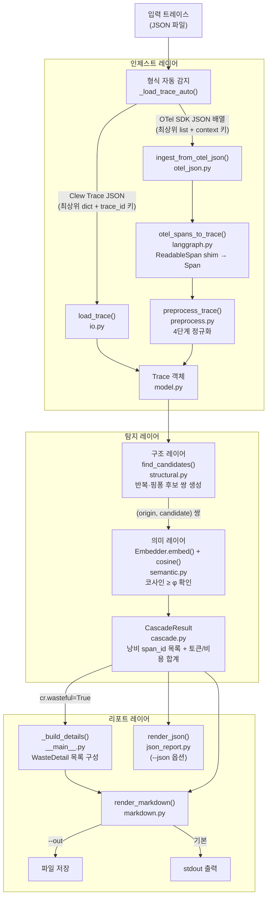

# Clew 아키텍처 문서

> 작성 기준: 2026-06-30. 코드 베이스 `src/clew/` 직접 읽고 작성.
> 추론은 [추론], 미확인은 [미확인]으로 표시. 나머지는 코드·커밋·검증 문서에서 직접 확인한 값.

---

## PART 1. 개념 이해

### 1.1 한 줄 정의

**Clew**는 멀티에이전트 AI 시스템의 실행 트레이스를 받아, 에이전트들이 같은 작업을 반복하며 낭비한 토큰과 비용을 탐지해 리포트하는 도구다.

#### 배경

멀티에이전트 시스템의 실패 원인은 종종 "모델이 멍청해서"가 아니라 **에이전트 사이의 구조적 문제** — 같은 노드가 반복 실행되거나, 두 에이전트가 서로 다시 묻는 핑퐁을 반복하거나, 이미 검색한 정보를 다시 검색하는 재조회 — 에서 발생한다. 이 낭비는 곧 **토큰 비용**이며, 기존 관측 도구는 에이전트 한 개 기준이라 이 "사이 층"을 보지 못한다.

Clew(아리아드네의 실타래, 영어 "clue"의 어원)는 그 낭비를 보이게 한다. 회사 이름 Custos는 라틴어로 "수호자·파수꾼".

---

### 1.2 5분 비기술 요약

**비유: 물류센터 감시 카메라**

생각해보자. 택배 물류센터에 카메라를 달았더니, 직원 한 명이 같은 상자를 창고에서 꺼냈다가 다시 넣고, 또 꺼냈다가 다시 넣는 장면이 찍혔다. 혹은 A 팀이 B 팀에게 "이 주소 맞나요?" 물어보고, B 팀이 A 팀에게 다시 물어보는 걸 반복하는 장면. Clew가 하는 일이 정확히 이것이다.

**입력:** AI 에이전트들이 서로 대화하고 도구를 쓴 전체 기록(트레이스 파일 하나, JSON 형식).

**처리:**
1. **정리** — 기록에서 핵심만 추린다. 내부 중간 기록이나 "경유 노드"는 제거하고, 진짜 작업을 한 에이전트들의 기록만 남긴다.
2. **구조 검사** — 같은 에이전트가 두 번 이상 나왔는지, 또는 A→B→A→B 패턴이 있는지, 같은 검색어로 두 번 검색했는지 확인해 "의심 목록"을 만든다.
3. **내용 확인** — 의심 목록 안의 두 기록이 실제로 비슷한 내용을 만들어냈는지 확인한다(다른 말로 같은 결과 → 낭비).
4. **비용 계산** — 낭비로 확정된 기록의 토큰 수와 예상 비용을 합산한다.

**출력:** "이 트레이스에서 researcher 노드가 2번 실행됐고, 두 출력이 92% 유사합니다. 낭비 추정 토큰: 240개." 같은 리포트.

**지금 단계(S0)의 정직한 한계:** 이 "내용 확인" 단계의 유사도 기준값(φ=0.514345)은 인공 합성 트레이스로 맞췄다. 실제 트레이스 5건을 돌려봤더니 낭비가 아닌 쌍의 유사도도 기준값보다 높게 나왔다. 즉 실제 환경에서 거짓 양성이 생길 수 있다. 자세한 내용은 Part 3.

---

### 1.3 큰 그림 아키텍처

> 아래 다이어그램은 `__main__._analyze()` (`:92`) 실제 호출 순서를 따른다.



**각 박스 한 줄 책임:**

| 박스 | 파일 | 책임 |
|------|------|------|
| `_load_trace_auto()` | `__main__.py:17` | 포맷 자동 판별 후 적합한 로더 호출 |
| `load_trace()` | `io.py:18` | Clew Trace JSON → `Trace` (pydantic 역직렬화) |
| `ingest_from_otel_json()` | `otel_json.py:110` | OTel SDK JSON 파일 → `_SdkJsonSpan` shim → 인제스트 경로 위임 |
| `otel_spans_to_trace()` | `langgraph.py:78` | OTel ReadableSpan 인터페이스 → 정규 `Trace` (변환만, 전처리 없음) |
| `preprocess_trace()` | `preprocess.py:170` | 4단계 정규화 파이프라인 (JSON 추출·worker 표시·LLM 접기·라우터 제거) |
| `find_candidates()` | `structural.py:71` | 시간순 스팬 시퀀스에서 반복·핑퐁 후보 쌍 생성 (라벨 미참조) |
| `Embedder` + `cosine()` | `semantic.py:54, 91` | 로컬 다국어 임베딩 + 코사인 유사도 계산, SQLite 캐시 |
| `cascade()` | `cascade.py:29` | 구조 후보 × 의미 게이트 결합 → `CascadeResult` |
| `_build_details()` | `__main__.py:72` | 낭비 span마다 최고 유사도 origin 매칭 → `WasteDetail` 목록 |
| `render_markdown()` | `report/markdown.py:18` | 사람이 읽는 마크다운 리포트 문자열 생성 |
| `render_json()` | `report/json_report.py:19` | 기계가 읽는 JSON 리포트 문자열 생성 |

---

### 1.4 핵심 설계 결정과 그 이유

#### 결정 1: 구조 레이어 → 의미 레이어 순서 (캐스케이드)

"낭비 = 구조 후보 **AND** 코사인 ≥ φ"로 정의한다(`cascade.py:4`).

- **구조만** 쓰면: 정당한 반복(다른 주제로 같은 도구를 두 번 쓰는 경우)도 후보에 올라 거짓 양성이 많다.
- **의미만** 쓰면: 전체 스팬 쌍 O(n²)을 임베딩해야 하므로 비용이 크고, 무엇을 비교해야 하는지 범위를 좁혀주는 게 없다.
- **순서 이유:** 구조 레이어가 먼저 후보를 좁혀서(입력 게이트로 불필요한 쌍 제거), 의미 레이어는 그 후보만 확인한다. `SPEC.md §8.3` 에 근거.

#### 결정 2: tool 스팬에 입력 게이트 적용

`find_repeat_candidates()` (`structural.py:46`)에서 `span_kind == "tool"`인 스팬은 재등장 시 `input_text`가 첫 등장과 정규화-동일(`strip().casefold()`)할 때만 후보로 올린다.

이유: 동일 도구를 다른 검색어로 두 번 호출하는 것은 정당한 작업이기 때문. 이 게이트가 `requery_known` 패턴 탐지의 핵심 경로다.

#### 결정 3: llm 스팬과 chain 스팬에는 입력 게이트 미적용

`find_pingpong_candidates()` (`structural.py:52`) 주석: "핑퐁 노드는 kind=="llm"이므로 입력 게이트 대상 아님(SPEC §8 2.1)." llm 스팬은 입력이 달라도 출력이 유사하면 낭비로 볼 수 있기 때문.

#### 결정 4: regen_handoff는 v1 범위 밖

`CRITERIA_FROZEN.md:74–78`에 명시: "구조 갭(find_candidates 후보 0; cross-node A→B 각 1회). cosine(A,B)=0.862 > φ — 의미 미스 아님, 순수 구조 미커버." A가 생성한 내용을 B가 재생성하는 패턴은 A·B 각각 1번씩만 등장해 반복 기준(N=2)을 충족하지 못하고, 핑퐁도 아니므로 구조 레이어에서 후보가 0개다. 의미 레이어 단독 탐지는 거짓 양성 위험이 크므로 명시적으로 v1에서 제외.

#### 결정 5: 로컬 임베딩 모델, API 아님

`semantic.py:82–88`: `SentenceTransformer` 로컬 실행. 이유: (a) 결정론 강제 가능(torch seed 0), (b) API 키 불필요, (c) 오프라인 작동, (d) 캐시로 동일 텍스트 재계산 방지.

#### 결정 6: 검증 정직성 설계 (핵심)

`CLAUDE.md §4`와 `CRITERIA_FROZEN.md`에 명시된 원칙:
- 탐지 코드(`src/clew/`)는 라벨(`eval/labels.jsonl`)을 절대 참조 안 함 → 11개 누수 가드 테스트로 강제.
- φ·N은 dev set(seed=7)으로만 결정, eval set(seed=42)은 한 번만 측정.
- 결과 후 기준 변경 금지.
- "만들었다" ≠ "신호가 있다." MVP의 첫 임무는 탐지기가 진짜 낭비를 잡는지 확인하는 것.

---

## PART 2. 코드 레벨 상세

### 2.1 디렉토리 구조

```
Custos - clwe project/
├── src/clew/                          # 패키지 루트 (name="clew", version="0.1.0")
│   ├── __init__.py                    # __version__ = "0.1.0"
│   ├── __main__.py                    # CLI 진입점 (python -m clew)
│   ├── model.py                       # 정규 데이터 모델 (Span, SpanNode, Trace)
│   ├── io.py                          # Trace ↔ JSON 파일 직렬화
│   ├── capture.py                     # LangGraph 앱 실행 + OTel 캡처 헬퍼
│   ├── ingest/
│   │   ├── __init__.py
│   │   ├── langgraph.py               # OTel ReadableSpan → Trace (공식 인제스트 경로)
│   │   ├── otel_json.py               # OTel SDK JSON 파일 → Trace (Format A)
│   │   └── preprocess.py              # 4단계 전처리 파이프라인
│   ├── detect/
│   │   ├── __init__.py
│   │   ├── structural.py              # 구조 후보 탐지 (라벨 미참조)
│   │   ├── semantic.py                # 코사인 유사도 + Embedder + SQLite 캐시
│   │   └── cascade.py                 # 구조+의미 결합 → CascadeResult
│   └── report/
│       ├── __init__.py
│       ├── _model.py                  # WasteDetail 데이터클래스
│       ├── markdown.py                # 사람용 마크다운 리포트
│       └── json_report.py             # 기계용 JSON 리포트
│
├── tests/                             # 총 171개 테스트 (pytest, 16 파일)
│   ├── conftest.py
│   ├── test_model.py                  # Span/Trace 검증 규칙 (16개)
│   ├── test_structural.py             # 구조 후보 탐지 (15개)
│   ├── test_cascade.py                # 캐스케이드 결합 (7개)
│   ├── test_semantic_determinism.py   # 임베딩 결정론 (10개)
│   ├── test_calibrate.py              # 캘리브레이션 (15개)
│   ├── test_langgraph_adapter.py      # OTel 어댑터 (10개)
│   ├── test_otel_json_ingest.py       # OTel SDK JSON 인제스트 (13개)
│   ├── test_generator.py              # 패턴 생성기 (36개)
│   ├── test_no_label_leakage.py       # 누수 가드 (11개) ★
│   ├── test_build_set.py              # eval set 생성 (8개)
│   ├── test_build_set_regression.py   # set 생성 회귀 (2개)
│   ├── test_evaluate_reproducible.py  # F1/FPR 재현 (6개)
│   ├── test_roundtrip.py              # save/load 왕복 (8개)
│   ├── test_field_regressions.py      # 실트레이스 시나리오 (6개)
│   ├── test_report_cli.py             # CLI 분석+리포트 (3개)
│   └── test_dod.py                    # 단계 경계 DoD (5개)
│
├── eval/                              # 검증 셋 (src/clew/ 와 완전 분리)
│   ├── labels.jsonl                   # seed=42, positive 40/negative 40
│   ├── set_manifest.json              # sha256 동결
│   ├── traces/                        # eval 트레이스 80건
│   ├── dev/seed-7/                    # 캘리브레이션용 dev 트레이스
│   ├── evaluate.py                    # 라벨과 비교 (src/clew 여기만 접근)
│   ├── calibrate.py                   # φ·N 결정용 (dev set만 읽음)
│   └── generators/
│       ├── build_set.py
│       └── patterns/                  # repeat_node, pingpong_aba, requery_known, regen_handoff
│
├── field_test/                        # 실트레이스 실험 (Claude Haiku 3노드 LangGraph)
│   ├── REAL_PROBE_LOG.md              # E1-E3 사전등록 결과
│   └── real_*.json / d5_*.md         # 시나리오별 트레이스·분석
│
├── validation/
│   ├── CRITERIA_FROZEN.md             # 동결 성공/중단 기준 ★
│   ├── CALIBRATION_LOG.md
│   └── EVAL_RUNS.md
│
├── examples/
│   ├── sample_otel_trace.json         # 실행 가능한 5-span 예제
│   └── README.md                      # 프레임워크별 export 코드 스니펫
│
├── SPEC.md                            # 단계별 상세 빌드 스펙
├── CLAUDE.md                          # Claude Code 세션 상시 컨텍스트
├── pyproject.toml                     # 패키지 설정
└── tasks.py                           # invoke 기반 빌드/테스트 태스크
```

---

### 2.2 모듈별 상세

#### 2.2.1 `src/clew/model.py` — 정규 데이터 모델

**책임:** OTel/OpenInference 스팬을 Clew 내부 정규 형태로 표현. Pydantic v2 기반. 모든 하위 모듈의 입력 타입.

**주요 타입 별칭:**
```python
# model.py:19
SpanKind = Literal["llm", "tool", "chain", "agent"]
```

**`Span` 클래스** (`model.py:22–70`, Pydantic v2 `BaseModel`):
```python
class Span(BaseModel):
    trace_id: str
    span_id: str
    parent_span_id: str | None
    agent_or_node_id: str
    span_kind: SpanKind
    start_time: datetime            # tz-aware UTC 강제
    end_time: datetime              # tz-aware UTC, >= start_time 강제
    input_text: str
    output_text: str                # strip() 후 비어있으면 ValueError
    token_count: int | None = None  # >= 0 강제
    model: str | None = None
    cost_rate: float | None = None  # >= 0 강제
```

검증 규칙 (field/model validator):
- `output_text`: strip 후 빈 문자열 → ValueError (`model.py:40–43`)
- `start_time`, `end_time`: tzinfo None → ValueError (`model.py:46–50`)
- `token_count`: < 0 → ValueError (`model.py:53–57`)
- `cost_rate`: < 0 → ValueError (`model.py:59–63`)
- `end_time < start_time` → ValueError (`model.py:66–70`)

**`SpanNode` 클래스** (`model.py:73–78`):
```python
class SpanNode(BaseModel):
    span: Span
    children: list[SpanNode] = Field(default_factory=list)
```

**`Trace` 클래스** (`model.py:83–150`):
```python
class Trace(BaseModel):
    trace_id: str
    spans: list[Span]
    metadata: dict[str, Any] = Field(default_factory=dict)
```

`_validate_tree` 모델 검증자 (`model.py:90–127`)가 강제하는 불변 조건:
1. `spans` 비어있지 않음
2. 모든 span의 `trace_id`가 `Trace.trace_id`와 일치
3. `span_id` 중복 없음
4. `parent_span_id=None`인 루트가 정확히 1개
5. 고아 없음 (parent_span_id가 실재하는 span_id를 참조)
6. 부모 체인에 사이클 없음

`build_tree() -> SpanNode` (`model.py:129–150`): 자식을 `start_time` 오름차순으로 정렬한 재귀 트리 반환.

---

#### 2.2.2 `src/clew/io.py` — 직렬화

```python
# io.py:13
def save_trace(trace: Trace, path: Path) -> None
    # Trace.model_dump_json(indent=2), UTF-8 저장

# io.py:18
def load_trace(path: Path) -> Trace
    # Trace.model_validate_json() 역직렬화
    # Raises: ValueError (파싱 실패 또는 스키마 불일치)
```

---

#### 2.2.3 `src/clew/ingest/langgraph.py` — OTel 어댑터 (공식 인제스트 경로)

**책임:** OTel `ReadableSpan` 객체 목록 → 정규 `Trace`. 프레임워크 비특정(LangGraph는 예시).

**스팬 종류 매핑** (`langgraph.py:32–38`):
```python
_KIND_MAP = {
    "LLM": "llm",
    "TOOL": "tool",
    "CHAIN": "chain",
    "RUNNABLE": "chain",
    "AGENT": "agent",
}
# 그 외 openinference.span.kind 값 → "chain" (langgraph.py:64–65)
```

**주요 함수:**
```python
# langgraph.py:78
def otel_spans_to_trace(
    spans: Sequence[ReadableSpan],
    *,
    cost_table: dict[str, float] | None = None,
    source_tag: str = "otel_adapter",
) -> Trace
# 변환만. preprocess_trace 호출 안 함. 테스트/디버깅 전용.
# Raises: ValueError (빈 spans / 다중 trace_id / 다중 루트 / 빈 output.value)

# langgraph.py:148
def ingest_otel_spans(
    spans: Sequence[ReadableSpan],
    *,
    cost_table: dict[str, float] | None = None,
    source_tag: str = "otel_adapter",
) -> Trace
# 공식 인제스트 경로 = otel_spans_to_trace() + preprocess_trace()
# 프로덕션/필드 사용은 반드시 이 함수.
```

내부 헬퍼 (모두 결정론적):
- `_hex_trace(int_id: int) -> str` — 32자 16진수 (`langgraph.py:41`)
- `_hex_span(int_id: int) -> str` — 16자 16진수 (`langgraph.py:45`)
- `_ns_to_utc(ns: int) -> datetime` — 나노초 → UTC datetime (`langgraph.py:49`)
- `_kind_of(attrs) -> SpanKind` — `openinference.span.kind` 속성 → `SpanKind` (`langgraph.py:61`)
- `_token_count_of(attrs)` — `llm.token_count.total` 속성 추출 (`langgraph.py:68`)
- `_model_of(attrs)` — `llm.model_name` 또는 `llm.provider` 추출 (`langgraph.py:73`)

---

#### 2.2.4 `src/clew/ingest/otel_json.py` — OTel SDK JSON 파일 인제스트

**책임:** `span.to_json()` 배열 파일(Format A) → `Trace`. `ingest_otel_spans()`로 위임해 `preprocess_trace`가 정확히 1회 실행.

```python
# otel_json.py:110
def ingest_from_otel_json(
    path: Path,
    *,
    cost_table: dict[str, float] | None = None,
) -> Trace
# Format A JSON 파일 → _parse_sdk_json() → _SdkJsonSpan shim → ingest_otel_spans()
# OTLP proto-JSON (resource_spans 키) 감지 시 변환 방법 안내 포함 ValueError
# Raises: ValueError (빈 파일, 형식 오류, output.value 없는 스팬)
```

`_SdkJsonSpan` (`otel_json.py:51`): `span.to_json()` dict를 `ReadableSpan` 인터페이스로 감싸는 경량 shim. `otel_spans_to_trace()`가 접근하는 필드만 구현(`.context.trace_id`, `.context.span_id`, `.parent.span_id`, `.name`, `.start_time`, `.end_time`, `.attributes`).

---

#### 2.2.5 `src/clew/ingest/preprocess.py` — 4단계 전처리 파이프라인

**책임:** `otel_spans_to_trace()` 직후, 탐지 전에 트레이스를 정규화. 순서가 중요함(`preprocess.py:178`에 명시).

```python
# preprocess.py:170
def preprocess_trace(trace: Trace) -> Trace
# ① extract_output_text — JSON 스캐폴드 제거
# ② mark_worker_span_ids — collapse 전 worker 집합 계산
# ③ collapse_llm_spans — llm 제거 + token rollup + ReAct re-parent
# ④ filter_router_spans — 라우터 chain span 제거
# metadata에 collapsed_llm_spans, filtered_router_spans 기록
```

각 단계:
```python
# preprocess.py:22
def extract_output_text(raw: str) -> str
# JSON → 재귀 str leaf 수집 → 가장 긴 non-empty 반환
# JSON 파싱 실패 또는 leaf 없으면 raw 원문 반환

# preprocess.py:58
def mark_worker_span_ids(spans: list[Span]) -> set[str]
# llm/tool 자손(transitive, BFS)을 가진 span_id 집합
# collapse 전에 반드시 실행 (llm 제거 후엔 llm 자손 판별 불가)

# preprocess.py:94
def collapse_llm_spans(
    spans: list[Span],
    worker_ids: set[str],
) -> tuple[list[Span], int]
# llm span 제거 + token_count를 부모 chain에 rollup
# ReAct: llm span 자식(tool 등)을 llm의 parent_span_id로 re-parent
# Returns: (남은 spans, 제거된 llm span 수)

# preprocess.py:151
def filter_router_spans(spans: list[Span], worker_ids: set[str]) -> list[Span]
# 조건: span_kind in ("chain", "agent") AND parent 있음 AND worker_ids 비포함
# 루트(parent=None)는 항상 보존
```

---

#### 2.2.6 `src/clew/detect/structural.py` — 구조 후보 탐지

**책임:** 시간순 스팬 시퀀스에서 반복·핑퐁 후보 `(origin, candidate)` 쌍 생성. 라벨·eval 미참조.

```python
# structural.py:27
def find_repeat_candidates(trace: Trace, n: int) -> list[tuple[Span, Span]]
# 같은 agent_or_node_id가 n회+ 등장 → (첫 등장, 재등장) 쌍
# tool kind: 재등장 input_text가 origin과 _normalize_input() 동일일 때만 후보
# 그 외 kind: 입력 게이트 미적용, 모든 재등장 → 후보
# Raises: ValueError if n < 2

# structural.py:52
def find_pingpong_candidates(trace: Trace) -> list[tuple[Span, Span]]
# 연속 4-span 윈도우에서 A1,B1,A2,B2 패턴(같은 node_id 교대) 탐지
# (A1,A2), (B1,B2) 두 쌍 반환
# 입력 게이트 없음 (llm kind 대상)

# structural.py:71
def find_candidates(trace: Trace, n: int) -> list[tuple[Span, Span]]
# find_repeat_candidates() + find_pingpong_candidates() 합산, (origin.span_id, cand.span_id) 중복 제거
```

내부 헬퍼:
```python
# structural.py:18
def _normalize_input(s: str) -> str
# s.strip().casefold() — 공백·대소문자만 정규화

# structural.py:23
def _spans_by_start_time(trace: Trace) -> list[Span]
# sorted by start_time ascending
```

---

#### 2.2.7 `src/clew/detect/semantic.py` — 의미 중복 확인

**책임:** 로컬 다국어 임베딩 모델로 두 텍스트의 코사인 유사도 계산. SQLite 캐시로 재계산 방지. 결정론 강제.

```python
# semantic.py:54
class Embedder:
    def __init__(
        self,
        model_name: str,   # 비어있으면 ValueError
        revision: str,     # 비어있으면 ValueError (40자 commit sha)
        cache_dir: Path,
    ) -> None
    # _SqliteCache(cache_dir/"embeddings.sqlite") 초기화
    # 모델 로딩은 첫 embed() 호출 시 lazy

    def embed(self, text: str) -> list[float]
    # sha256(model_name|revision|text) 캐시 조회 → 없으면 _compute() 후 저장
    # Returns: L2-normalized float list

    def _compute(self, text: str) -> list[float]
    # SentenceTransformer.encode(text, normalize_embeddings=True, convert_to_numpy=True)

    def _load_model(self) -> None
    # torch.manual_seed(0) 설정 후 SentenceTransformer(model_name, revision=revision) 로드
    # self._model.eval()

# semantic.py:91
def cosine(a: list[float], b: list[float]) -> float
# dot(a,b) / (|a|·|b|). 길이 불일치 → ValueError. 영벡터 → 0.0

# semantic.py:102
def is_semantic_duplicate(
    origin_text: str,
    candidate_text: str,
    embedder: Embedder,
    phi: float,
) -> bool
# cosine(embed(origin), embed(candidate)) >= phi
```

`_SqliteCache` (`semantic.py:26–52`): `embeddings(key TEXT PRIMARY KEY, vector TEXT NOT NULL)` 테이블. key = `_cache_key()` 반환값.

```python
# semantic.py:21
def _cache_key(model_name: str, revision: str, text: str) -> str
# sha256(f"{model_name}|{revision}|{text}".encode()).hexdigest()
```

---

#### 2.2.8 `src/clew/detect/cascade.py` — 캐스케이드 결합

**책임:** 구조 후보 × 의미 게이트 → `CascadeResult`. 낭비 비용 합산.

```python
# cascade.py:21
@dataclass
class CascadeResult:
    trace_id: str
    wasteful: bool
    waste_span_ids: list[str] = field(default_factory=list)
    waste_tokens: int = 0
    waste_cost: float = 0.0

# cascade.py:29
def cascade(trace: Trace, embedder: Embedder, n: int, phi: float) -> CascadeResult
# Step 1: find_candidates(trace, n) → (origin, candidate) 쌍 목록
# Step 2: 각 candidate (중복 건너뜀):
#   cosine(embed(origin.output_text), embed(candidate.output_text)) >= phi
#   → True이면 waste_span_ids에 추가
# Step 3: 낭비 span의 token_count × cost_rate 합산
# → CascadeResult 반환
```

---

#### 2.2.9 `src/clew/report/` — 리포트

**`_model.py:10`** — `WasteDetail` 데이터클래스:
```python
@dataclass
class WasteDetail:
    origin: Span       # 첫 등장 (정당한 실행)
    candidate: Span    # 재등장 (낭비)
    cosine: float      # 두 output_text 간 코사인

    @property
    def waste_tokens(self) -> int | None   # candidate.token_count
    @property
    def waste_cost(self) -> float | None   # candidate.token_count * candidate.cost_rate
                                           # 둘 중 하나 None이면 None 반환
```

**`markdown.py:18`** — `render_markdown()`:
```python
def render_markdown(
    trace: Trace,
    cr: CascadeResult,
    details: list[WasteDetail],
    *,
    no_snippets: bool = False,
    snippet_len: int = 80,       # _SNIPPET_LEN = 80 (markdown.py:15)
) -> str
# 헤더: trace_id, analyzed, 동결 파라미터(φ, N, 모델명) 출력
# 낭비 있음: 낭비 span 수·토큰·비용 + 테이블(origin|repeat|cosine|tokens|cost) + 스니펫
# 낭비 없음: "no waste detected" 메시지
# 푸터: 합성 트레이스 기반 캘리브레이션 경고 메시지 포함
```

**`json_report.py:19`** — `render_json()`:
```python
def render_json(
    trace: Trace,
    cr: CascadeResult,
    details: list[WasteDetail],
    *,
    no_snippets: bool = False,
    snippet_len: int = 80,       # _SNIPPET_LEN = 80 (json_report.py:16)
) -> str
# Returns: JSON 문자열 (indent=2, ensure_ascii=False)
# 최상위 키: trace_id, analyzed, detector_params, wasteful,
#             waste_span_count, total_tokens_wasted, total_cost_wasted,
#             waste_details, note
```

---

#### 2.2.10 `src/clew/capture.py` — LangGraph 캡처 헬퍼

```python
# capture.py:25
def capture_langgraph(
    app: Any,
    inputs: dict[str, Any],
    out_path: Path,
    *,
    cost_table: dict[str, float] | None = None,
) -> Trace
# LangGraph 전용. app.invoke(inputs) 실행 + OpenInference 계측 + InMemorySpanExporter
# → ingest_otel_spans() → save_trace()
# requires: clew[adapter] extra
# Returns: 저장된 Trace 객체

capture_to_file = capture_langgraph  # capture.py:76 (별칭)
```

범용 파일 입력(`OTel SDK JSON → Trace`)은 이 함수가 아니라 `ingest_from_otel_json()`을 사용.

---

### 2.3 데이터 모델

#### 핵심 데이터 흐름에서의 타입 변화

```
외부 입력 (파일)
    ↓
dict (json.loads)          — __main__._load_trace_auto() 내부
    ↓
ReadableSpan / _SdkJsonSpan — OTel 인터페이스 (실제 또는 shim)
    ↓
Span (Pydantic v2)         — model.py:22, 정규화된 단일 스팬
    ↓
Trace (Pydantic v2)        — model.py:83, 스팬 목록 + 메타데이터
    ↓
(origin Span, candidate Span) 쌍  — structural.py, 후보 쌍
    ↓
CascadeResult (dataclass)  — cascade.py:21, 낭비 판정 결과
    ↓
WasteDetail (dataclass)    — report/_model.py:10, 리포트용 상세
    ↓
str (markdown 또는 JSON)   — 최종 출력
```

#### `Span` 필드 상세

| 필드 | 타입 | 필수 | 검증 | 비고 |
|------|------|------|------|------|
| `trace_id` | `str` | ✅ | — | 트레이스 식별자 |
| `span_id` | `str` | ✅ | Trace 내 중복 불허 | 스팬 식별자 |
| `parent_span_id` | `str \| None` | ✅ | `None`이면 루트 | 루트는 정확히 1개 |
| `agent_or_node_id` | `str` | ✅ | — | 탐지의 핵심 키 |
| `span_kind` | `SpanKind` | ✅ | Literal 4종 | llm/tool/chain/agent |
| `start_time` | `datetime` | ✅ | tz-aware UTC | 나노초 int에서 변환 |
| `end_time` | `datetime` | ✅ | tz-aware, ≥ start | |
| `input_text` | `str` | ✅ | — | tool 입력 게이트 대상 |
| `output_text` | `str` | ✅ | strip 후 non-empty | 의미 비교의 입력 |
| `token_count` | `int \| None` | 선택 | ≥ 0 | 비용 계산 사용 |
| `model` | `str \| None` | 선택 | — | cost_table lookup 키 |
| `cost_rate` | `float \| None` | 선택 | ≥ 0 | 토큰당 비용 |

---

### 2.4 처리 파이프라인 상세

> 아래 다이어그램은 `_analyze()` (`__main__.py:92`)의 실제 호출 순서를 따른다. `preprocess_trace()`는 인제스트 경로 안에서만 호출되며 `_analyze()`에서 직접 호출하지 않음.


---

### 2.5 탐지 로직 정밀

#### 탐지 가능한 패턴 (v1 범위 내)

**패턴 1: `repeat_node`** — 같은 에이전트/노드 N회+ 반복

탐지 코드: `find_repeat_candidates()` (`structural.py:27–49`)

판정 조건:
1. `agent_or_node_id` 기준으로 스팬을 그룹
2. 그룹 크기 ≥ N(=2)
3. `span_kind == "tool"`이면 추가 조건: 재등장 `input_text`가 origin과 `_normalize_input()` 동일
4. `span_kind != "tool"`이면 조건 3 없이 모든 재등장 → 후보

구조 후보 확정 후: `cosine(embed(origin.output_text), embed(candidate.output_text)) >= 0.514345` 이면 낭비 확정.

**패턴 2: `pingpong_aba`** — A→B→A→B 교대 반복

탐지 코드: `find_pingpong_candidates()` (`structural.py:52–68`)

판정 조건:
```python
# structural.py:59-65
for i in range(len(ordered) - 3):
    a1, b1, a2, b2 = ordered[i], ordered[i+1], ordered[i+2], ordered[i+3]
    if (a1.agent_or_node_id == a2.agent_or_node_id
        and b1.agent_or_node_id == b2.agent_or_node_id
        and a1.agent_or_node_id != b1.agent_or_node_id):
        pairs.append((a1, a2)); pairs.append((b1, b2))
```
연속 4-span 슬라이딩 윈도우. 입력 게이트 없음(`structural.py:6`에 명시).

**패턴 3: `requery_known`** — 동일 입력으로 같은 도구 재조회

`repeat_node`의 특수형. `span_kind == "tool"` + 입력 게이트 통과 → 후보. 탐지 경로: `find_repeat_candidates()`의 도구 분기. 합성 데이터 TPR: 1.0 (`CRITERIA_FROZEN.md:72`).

#### 탐지 범위 밖 (v1)

**패턴 4: `regen_handoff`** — A가 생성한 내용을 B가 재생성

범위 밖 근거 (`CRITERIA_FROZEN.md:74–78`): "구조 갭(find_candidates 후보 0; cross-node A→B 각 1회)." A·B는 서로 다른 노드이고 각각 1번만 등장하므로 `find_repeat_candidates()`(N=2 미충족)와 `find_pingpong_candidates()`(4-span 패턴 불일치) 모두 후보 0개. 합성 데이터에서 `cosine(A,B)=0.862 > φ`로 의미 유사성이 높았으나, 구조 후보가 없어 의미 레이어에 도달하지 않는다. 의미 레이어만으로 탐지하면 거짓 양성 위험이 있어 v1 명시적 제외.

#### 캐스케이드 결합 지점

`cascade.py:34–39`:
```python
for origin, candidate in find_candidates(trace, n):   # 구조 레이어
    if candidate.span_id in seen_candidates:
        continue
    if cosine(                                         # 의미 레이어
        embedder.embed(origin.output_text),
        embedder.embed(candidate.output_text)
    ) >= phi:
        waste_span_ids.append(candidate.span_id)
        seen_candidates.add(candidate.span_id)
```

두 레이어 모두 True일 때만 낭비 확정. 구조 후보가 없으면 의미 레이어에 도달하지 않는다.

#### ⚠️ 실데이터 미검증 — 인라인 경고

의미 레이어(코사인 ≥ φ)의 분리력은 **합성 트레이스에서만 검증됨**. `REAL_PROBE_LOG.md`에 기록된 실트레이스 5건 결과:

| 시나리오 | 비낭비 스팬 쌍 중 코사인 > φ | 최솟값 |
|----------|------------------------------|--------|
| clean | 6/6 (100%) | 0.6497 |
| repeat_node | 6/6 (100%) | 0.7129 |
| requery_known | 10/10 (100%) | 0.6320 |
| requery_clean | 15/15 (100%) | 0.5899 |
| pingpong | 3/3 (100%) | 0.6592 |

비낭비 스팬들도 모두 φ=0.514345보다 높은 코사인을 가진다. 같은 주제('quantum computing basics')의 출력들이 어휘를 공유해 베이스라인 유사도가 높기 때문. 즉 **구조 레이어가 후보를 만들어냈다면 의미 레이어가 걸러내지 못했을 것이다.**

단 5건, 단일 주제 관찰이므로 확정 아님. 다른 도메인·언어에서 다를 수 있음. `φ`를 사후에 올리는 것은 금지 (`REAL_PROBE_LOG.md:210`). 재설계는 추가 실트레이스 3–5건 확보 후 별도 사전등록 실험에서만 진행.

---

### 2.6 핵심 파라미터

#### 동결 파라미터 (변경 금지)

| 파라미터 | 값 | 정의 위치 | 사용 위치 | 동결 출처 |
|----------|-----|-----------|-----------|----------|
| φ (코사인 임계) | `0.514345` | `__main__.py:65` | `cascade()` 호출 (`__main__.py:121`), 리포트 헤더 (`markdown.py:11`, `json_report.py:11`) | `CRITERIA_FROZEN.md:22`, git tag `stage2-detector-freeze` |
| N (반복 임계) | `2` | `__main__.py:66` | `cascade()` 호출 (`__main__.py:121`), `_build_details()` (`__main__.py:78`) | `CRITERIA_FROZEN.md:23` |
| 임베딩 모델명 | `"paraphrase-multilingual-MiniLM-L12-v2"` | `__main__.py:67` | `Embedder()` 생성 (`__main__.py:120`), 리포트 헤더 | `CRITERIA_FROZEN.md:24` |
| 임베딩 모델 revision | `"e8f8c211226b894fcb81acc59f3b34ba3efd5f42"` | `__main__.py:68` | `Embedder()` 생성 (`__main__.py:120`) | `CRITERIA_FROZEN.md:24` |

**`__main__.py:65–68`과 `CRITERIA_FROZEN.md:22–24` 대조 결과: 4개 값 모두 일치.**

`report/markdown.py:11–14`와 `report/json_report.py:11–14`에도 φ, N, 모델명이 상수로 복사되어 있음. CLI가 직접 주입하지 않고 각 리포트 모듈이 독립적으로 보유하는 구조. [추론: 리포트 모듈이 단독으로도 정확한 파라미터를 표시하기 위한 설계로 보임. 단, 세 곳에 상수가 분산되어 있어 파라미터 재동결 시 세 파일 모두 수동 갱신 필요.]

#### 임베딩 캐시

- 위치: `~/.cache/clew/embeddings/embeddings.sqlite` (`__main__.py:69`)
- 키: `sha256(model_name|revision|text)` (`semantic.py:22`)
- 결정론 보장: `torch.manual_seed(0)` (`semantic.py:86`) + `normalize_embeddings=True` (`semantic.py:79`)

#### ⚠️ φ 실데이터 미검증 — 인라인 경고

φ=0.514345는 dev set(seed=7, 합성 트레이스)에서 `calibrate.py`로 결정. 실트레이스 5건에서 비낭비 스팬의 코사인 최솟값이 0.59였으므로(2.5절 표 참조), 현재 φ는 실환경에서 낭비/비낭비를 분리하지 못할 가능성이 있음. φ를 올리는 것은 eval set을 본 이후이므로 금지. 재설계 경로는 Part 3 참조.

---

### 2.7 CLI

**진입점:**
```bash
python -m clew analyze <trace.json> [--out report.md] [--json out.json] [--no-snippets]
```

**인자 파서** (`__main__.py:146–161`):

| 인자 | 형식 | 설명 |
|------|------|------|
| `trace_file` | positional | 분석할 트레이스 JSON 파일 경로 |
| `--out report.md` | 선택 | 마크다운 리포트를 파일로 저장 (미지정 시 stdout) |
| `--json out.json` | 선택 | JSON 리포트를 파일로 저장 (`dest="json_out"`) |
| `--no-snippets` | 선택 | 리포트에서 output_text 스니펫 제외 |

**포맷 자동 감지** (`_load_trace_auto()`, `__main__.py:17–62`):

```
JSON 파싱
├── dict이고 "trace_id" 키 있음 → load_trace()  [Clew Trace JSON]
├── dict이고 "resource_spans"/"resourceSpans" 있음 → ValueError + 변환 안내
├── dict이고 그 외 → ValueError (알 수 없는 형식)
├── list이고 첫 원소에 "context" 키 있음 → ingest_from_otel_json()  [OTel SDK JSON]
└── list이고 그 외 → ValueError (context 키 없음)
```

**종료 코드:** 낭비 탐지·미탐지 모두 0. 파일 없음·스키마 오류·의존성 없음 → 1.

**detect 의존성 없을 때** (`__main__.py:113–118`):
```
Error: detect dependencies missing — pip install 'clew[detect]'
```

---

### 2.8 테스트·검증 구조

#### 테스트 개수 (pytest 실측, 2026-06-30 기준)

| 파일 | 테스트 수 | 커버리지 대상 |
|------|-----------|--------------|
| `test_generator.py` | 36 | 패턴 생성기 4종 (repeat_node, pingpong_aba, requery_known, regen_handoff) |
| `test_model.py` | 16 | Span/Trace 검증 규칙, build_tree() |
| `test_structural.py` | 15 | repeat/pingpong 후보 탐지, 입력 게이트 |
| `test_calibrate.py` | 15 | dev set 임베딩 분리, φ·N 선택 로직 |
| `test_otel_json_ingest.py` | 13 | OTel SDK JSON Format A 파싱, 거부 동작 |
| `test_no_label_leakage.py` | 11 | **누수 가드 (★ 핵심)** |
| `test_semantic_determinism.py` | 10 | 임베딩 결정론 (torch seed, 캐시 히트) |
| `test_langgraph_adapter.py` | 10 | OTel ReadableSpan → Trace 변환 |
| `test_roundtrip.py` | 8 | save_trace ↔ load_trace 왕복 |
| `test_build_set.py` | 8 | eval set 생성 (seed, 분포 균형) |
| `test_cascade.py` | 7 | 구조+의미 결합, waste_tokens/cost 합산 |
| `test_field_regressions.py` | 6 | 실트레이스 E1–E3 회귀 (5종 시나리오) |
| `test_evaluate_reproducible.py` | 6 | F1/FPR 재현성 |
| `test_dod.py` | 5 | 단계 경계 DoD (모듈 존재 확인) |
| `test_report_cli.py` | 3 | CLI end-to-end (마크다운+JSON+no-snippets) |
| `test_build_set_regression.py` | 2 | 표준 seed 회귀 |
| **합계** | **171** | |

#### 누수 가드 3종 (`test_no_label_leakage.py`)

**가드 (b) 정적 스캔** (`test_no_label_leakage.py:41–67`):
- `src/clew/` 내 모든 `.py`를 AST 파싱해 `eval.*` 또는 `labels` 모듈 import 탐지
- `src/clew/` 내 본문에 `"eval/labels"`, `"labels.jsonl"`, `"set_manifest.json"` 등 경로 리터럴 탐지
- `# noqa-leak` 우회 주석 탐지 (`test_no_label_leakage.py:71–77`)

**가드 (c) 런타임 프로브** (`test_no_label_leakage.py:84–101`):
- `builtins.open` 몽키패치로 `clew`, `clew.model`, `clew.ingest.langgraph` import 시 실제로 라벨 파일이 열리는지 추적

**가드 (d) DoD** (`test_no_label_leakage.py:108–124`):
- `src/clew/detect/`에 정확히 `__init__.py`, `cascade.py`, `semantic.py`, `structural.py` 4개만 있음을 강제
- `src/clew/report/`에 정확히 `__init__.py`, `_model.py`, `json_report.py`, `markdown.py` 4개만 있음을 강제

**교차 가드** (calibrate ↔ evaluate 분리):
- `calibrate.py`는 `eval/traces` (eval set) 경로 미참조 확인
- `evaluate.py`는 `eval/dev` (dev set) 경로 미참조 확인

#### 검증 결과 및 git 태그

| 태그 | 의미 |
|------|------|
| `stage1-freeze` | 1단계 하니스 동결 (0fa25e0) |
| `stage2-eval-freeze` | eval set 동결 (seed=42, 80 트레이스) |
| `stage2-detector-freeze` | φ=0.514345, N=2 동결 |
| `stage2-eval-go` | eval set 측정 결과: F1=0.8571, FPR=0.0000 |
| `ingest-hardening-v1` | 전처리 파이프라인 완성 |
| `report-cli-v1` | 3단계(리포트·CLI) 완성 |
| `real-probe-v1` | 실트레이스 5종 E1·E2 5/5 PASS |
| `input-generalization-v1` | OTel SDK JSON 인제스트(Format A) 완성 |

#### 합성 데이터 검증 지표 (`CRITERIA_FROZEN.md:69–73`)

| 지표 | 값 | 기준 |
|------|-----|------|
| trace-level F1 | **0.8571** | ≥ 0.80 (GO) |
| Control FPR | **0.0000** | ≤ 0.10 (GO) |
| TP / FP / TN / FN | 30 / 0 / 40 / 10 | — |
| repeat_node TPR | 1.0 | in-scope |
| pingpong_aba TPR | 1.0 | in-scope |
| requery_known TPR | 1.0 | in-scope |
| regen_handoff TPR | 0.0 | out-of-scope (명시적 제외) |

#### ⚠️ 실트레이스 FP=0의 실제 의미

`REAL_PROBE_LOG.md`의 E3 발견: "FP=0은 구조 레이어(`find_repeat_candidates`)가 후보를 만들지 않은 결과이며, 의미 레이어(φ 게이트)가 분리해낸 것이 아니다."

clean·requery_clean 시나리오에서 FP=0인 것은 구조 레이어가 후보 자체를 만들지 않았기 때문. 만약 구조 레이어가 후보를 만들었다면, 비낭비 스팬들의 코사인도 모두 φ를 초과하므로 의미 레이어가 FP를 걸러내지 못했을 것이다. 즉 현재 FP=0은 의미 레이어 성능이 아닌 구조 레이어의 입력 게이트 정확도를 반영한다.

---

### 2.9 확장 포인트

#### 새 탐지 패턴 추가

1. **구조 레이어에 새 탐지 함수 추가** (`structural.py`): 새 `find_xxx_candidates(trace, ...) -> list[tuple[Span, Span]]` 함수 작성.
2. **`find_candidates()`에 통합** (`structural.py:71–81`): `find_repeat_candidates() + find_pingpong_candidates()` 목록에 추가.
3. **eval 생성기 추가** (`eval/generators/patterns/`): `base.py`의 패턴 생성기 인터페이스를 따르는 새 파일.
4. **누수 가드는 자동 통과**: `src/clew/`에 라벨 경로 미포함이면 추가 작업 불필요.

#### 새 프레임워크 어댑터 추가

**경로 1 (권장): OTel SDK JSON 파일**
프레임워크가 OTel SDK를 지원하면 `ingest_from_otel_json()`이 이미 처리. 추가 코드 없음.

**경로 2: 새 ReadableSpan shim 작성**
`otel_json.py`의 `_SdkJsonSpan` 패턴을 참고해 새 포맷의 shim을 만들고 `ingest_otel_spans()`에 넘기면 이후 파이프라인 공유 가능.

**경로 3: 새 인제스트 모듈**
`ingest/` 아래 새 파일 추가. 출력은 반드시 `preprocess_trace()`를 통과한 `Trace` 객체여야 하며, `ingest_otel_spans()`처럼 `otel_spans_to_trace() + preprocess_trace()` 구조를 따른다.

---

## PART 3. 현실 직시

### 3.1 구현됨(S0) vs 계획됨(S1–S∞)

| 기능 | 상태 | 근거 |
|------|------|------|
| OTel SDK JSON 파일 인제스트 (Format A) | ✅ 구현 | `otel_json.py`, tag `input-generalization-v1` |
| LangGraph 앱 직접 캡처 | ✅ 구현 | `capture.py`, `[adapter]` extra |
| Clew Trace JSON 로드/저장 | ✅ 구현 | `io.py` |
| 4단계 전처리 파이프라인 | ✅ 구현 | `preprocess.py` |
| 구조 탐지: repeat_node | ✅ 구현 | `structural.py:find_repeat_candidates()` |
| 구조 탐지: pingpong_aba | ✅ 구현 | `structural.py:find_pingpong_candidates()` |
| 구조 탐지: requery_known | ✅ 구현 | `structural.py:find_repeat_candidates()` (tool 입력 게이트) |
| 의미 중복 확인 (코사인 ≥ φ) | ✅ 구현 | `semantic.py`, `cascade.py` |
| 낭비 토큰·비용 합산 | ✅ 구현 | `cascade.py:41–48` |
| 마크다운 + JSON 리포트 | ✅ 구현 | `report/markdown.py`, `report/json_report.py` |
| CLI (`python -m clew analyze`) | ✅ 구현 | `__main__.py` |
| regen_handoff 탐지 | ❌ v1 제외 | 구조 신호 부재, `CRITERIA_FROZEN.md:74–78` |
| OTLP proto-JSON (resource_spans) 인제스트 | ❌ 미구현 | `otel_json.py:86–95` (거부 메시지만) |
| LangSmith / Langfuse export 인제스트 | ❌ 계획 없음 | `CLAUDE.md §5`, 고객 수요 기반 별도 단계 |
| 실시간 차단 (S1) | ❌ 계획 | `CLAUDE.md §5` |
| 멀티에이전트 그래프 관측 (S2) | ❌ 계획 | `CLAUDE.md §5` |
| 수렴·건강성 지능 (S3) | ❌ 계획 | `CLAUDE.md §5` |
| Guardian 자율 감독 (S4) | ❌ 계획 | `CLAUDE.md §5` |
| 거버넌스 레이어 (S5) | ❌ 계획 | `CLAUDE.md §5` |

### 3.2 한계·미검증

#### 1. φ-transfer 문제 (가장 중요한 미검증 사항)

φ=0.514345는 합성 트레이스 dev set(seed=7)에서 결정. 실트레이스 5건 결과(`REAL_PROBE_LOG.md`): 비낭비 스팬 코사인 최솟값 0.59, 중앙값 0.68–0.81. φ가 비낭비/낭비를 분리하지 못한다.

**현재 FP=0인 이유:** 구조 레이어의 입력 게이트가 FP 후보를 애초에 만들지 않아서. 구조 레이어가 실패하면 의미 레이어가 백스탑 역할을 못 한다.

**해결 경로:** 다른 도메인·언어 실트레이스 3–5건 추가 수집 → 분포 확인 → 별도 사전등록 실험. φ 사후 조정은 금지(`REAL_PROBE_LOG.md:210`).

#### 2. 합성 데이터 기반 F1=0.8571

eval set 80트레이스가 합성 생성기(`eval/generators/`)로 만들어졌으므로, 실환경의 실제 낭비 트레이스 분포와 다를 수 있음. 실측 낭비 절감 데이터 0건. 출시 기준 중 "진짜 뭔가 잡았다" 양성 피드백은 아직 미측정(`CRITERIA_FROZEN.md:49–52`).

#### 3. regen_handoff 탐지 미구현

전체 낭비 시나리오 중 regen_handoff(다른 에이전트가 같은 내용을 재생성)는 v1에서 탐지 불가. eval set에서 10건 포함되어 있으나 모두 FN. 비커버는 결함이 아닌 명시적 설계 범위 결정(`CRITERIA_FROZEN.md:76–78`).

#### 4. 비용 계산 정밀도

`cascade.py:45–48`: `waste_cost += tc * cr` — `token_count × cost_rate(상수)`. 실제 API는 프롬프트 토큰과 출력 토큰 단가가 다르고, 배치 할인·캐시 할인 등 변동 요인이 있다. 추정치로 봐야 한다. `token_count` 또는 `cost_rate`가 None이면 "unknown" 표시.

#### 5. 단일 주제 실트레이스

실트레이스 5건 모두 주제 'quantum computing basics', 모델 Claude Haiku 3, 같은 3노드 그래프(`field_test/real_app.py`). 다른 도메인·언어·그래프 구조에서의 동작은 미확인.

---

## 참고: 의존성

```toml
# pyproject.toml
[project.dependencies]
pydantic >= 2.6              # 데이터 모델 (항상 필요)

[project.optional-dependencies]
adapter = [                  # LangGraph 직접 캡처 시
    "langgraph>=0.2",
    "langchain-core>=0.3",
    "openinference-instrumentation-langchain>=0.1",
    "opentelemetry-sdk>=1.25",
    "opentelemetry-api>=1.25",
]
detect = [                   # 의미 레이어 (CLI 실행 시 필요)
    "sentence-transformers>=3.0",
    "torch>=2.0",
    "huggingface_hub>=0.20",
]
dev = [
    "pytest>=8.0",
]
```

설치:
```bash
pip install -e ".[detect]"           # CLI 분석만 (OTel SDK JSON → 리포트)
pip install -e ".[adapter,detect]"   # LangGraph 앱 직접 캡처 포함
```
