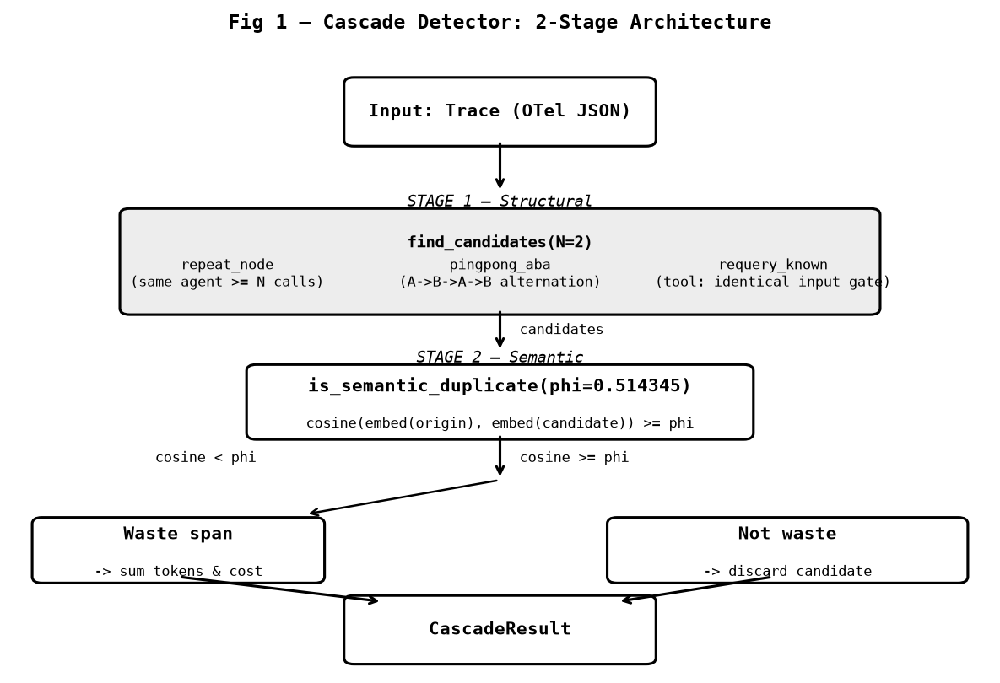

# 03 — Architecture: Cascade Detector

> **Source of truth**: this document was written by reading `src/clew/` directly.
> Where SPEC.md or ARCHITECTURE.md use a different name for a function, the code name is used
> and the discrepancy is noted inline.

---

## Module Map

```
src/clew/
├── __init__.py          package metadata (version "0.1.0")
├── __main__.py          CLI entry point — python -m clew analyze
├── model.py             canonical data models: Span, SpanNode, Trace (Pydantic)
├── io.py                Trace JSON serialization: load_trace() / save_trace()
├── capture.py           LangGraph instrumentation helper (capture_langgraph)
│
├── ingest/
│   ├── langgraph.py     OTel ReadableSpan → Trace adapter
│   │                    otel_spans_to_trace() — raw conversion
│   │                    ingest_otel_spans()   — production path (+ preprocess)
│   ├── otel_json.py     OTel SDK JSON file → Trace loader (Format A)
│   │                    ingest_from_otel_json()
│   └── preprocess.py    4-stage preprocessing pipeline
│                        preprocess_trace() — pipeline entry point
│
├── detect/
│   ├── structural.py    structural pattern finder
│   │                    find_repeat_candidates(), find_pingpong_candidates(),
│   │                    find_candidates()
│   ├── semantic.py      embedding model + cosine similarity
│   │                    Embedder class, cosine(), is_semantic_duplicate()
│   └── cascade.py       2-stage cascade orchestrator
│                        cascade() → CascadeResult
│
└── report/
    ├── _model.py        WasteDetail dataclass
    ├── markdown.py      human-readable report: render_markdown()
    └── json_report.py   machine-readable report: render_json()
```

---

## Canonical Span Tree Model

All models live in `src/clew/model.py` and are strict Pydantic `BaseModel` instances.

### `SpanKind`

```python
SpanKind = Literal["llm", "tool", "chain", "agent"]
```

### `Span`

| Field | Type | Required | Constraint |
|---|---|---|---|
| `trace_id` | `str` | yes | matches parent Trace |
| `span_id` | `str` | yes | unique within trace |
| `parent_span_id` | `str \| None` | yes | `None` for root; must exist if set |
| `agent_or_node_id` | `str` | yes | node/LLM/tool name |
| `span_kind` | `SpanKind` | yes | one of llm / tool / chain / agent |
| `start_time` | `datetime` | yes | UTC timezone-aware |
| `end_time` | `datetime` | yes | UTC, >= start_time |
| `input_text` | `str` | yes | may be empty |
| `output_text` | `str` | yes | **non-empty after strip** (SPEC §8 1.1) |
| `token_count` | `int \| None` | no | >= 0 if set |
| `model` | `str \| None` | no | LLM model name |
| `cost_rate` | `float \| None` | no | >= 0 if set; USD per token |

### `SpanNode`

Tree node produced by `Trace.build_tree()`. Children sorted by `start_time`.

```python
class SpanNode(BaseModel):
    span: Span
    children: list[SpanNode] = []
```

### `Trace`

```python
class Trace(BaseModel):
    trace_id: str
    spans: list[Span]           # >= 1 span
    metadata: dict[str, Any]    # optional; preprocessing adds keys here
```

Validation rules enforced at construction:
- Exactly **one root** span (`parent_span_id is None`).
- No duplicate `span_id` values.
- No orphan spans (every `parent_span_id` must exist).
- No cycles in the parent chain.
- All spans must carry the same `trace_id` as the enclosing `Trace`.

---

## Input Gate

`_load_trace_auto()` in `src/clew/__main__.py` auto-detects the file format before
handing off to the appropriate ingest path.

```
File contents
      │
      ├─ top-level dict with "trace_id" key
      │      └─→ load_trace()                (Clew native JSON)
      │
      ├─ top-level list, first item has "context" key
      │      └─→ ingest_from_otel_json()     (OTel SDK JSON — Format A)
      │
      ├─ top-level dict with "resource_spans" / "resourceSpans"
      │      └─→ ValueError with migration guide  (Format B — OTLP proto-JSON, not supported)
      │
      └─ anything else
             └─→ ValueError
```

**Format A** (supported): output of `span.to_json()` collected into a JSON array.
**Format B** (rejected): OTLP proto-JSON with `resource_spans` wrapper — the CLI
prints a conversion guide and exits non-zero.

---

## Preprocessing Pipeline

`preprocess_trace()` in `src/clew/ingest/preprocess.py` runs four stages in order.
The pipeline is called by every production ingest path after raw span conversion.

```
preprocess_trace(trace: Trace) -> Trace
         │
         ├── Stage 1: extract_output_text(raw: str) -> str
         │      Traverse the JSON tree in output_text; return the longest
         │      non-empty string leaf.  Removes scaffolding keys like
         │      "status", "error", leaving only the substantive content.
         │
         ├── Stage 2: mark_worker_span_ids(spans) -> set[str]
         │      BFS over each span's subtree.
         │      A span is a *worker* if it has any llm or tool descendant
         │      (transitive, not just direct children).
         │      Implemented by _has_llm_or_tool_descendant().
         │      ┌─────────────────────────────────────────────────────┐
         │      │ NOTE: SPEC.md calls this function "has_llm_or_tool_ │
         │      │ child". The actual code name is                      │
         │      │ _has_llm_or_tool_descendant — it checks descendants, │
         │      │ not just direct children.                            │
         │      └─────────────────────────────────────────────────────┘
         │      Must run BEFORE Stage 3 (collapse removes llm spans).
         │
         ├── Stage 3: collapse_llm_spans(spans, worker_ids) -> (list[Span], int)
         │      Remove every span with span_kind=="llm".
         │      token_count of removed llm spans is rolled up to their parent.
         │      ReAct re-parent: if an llm span had children (e.g. tool spans),
         │      those children are re-parented to the llm's parent so no span
         │      becomes orphaned.
         │      ┌─────────────────────────────────────────────────────┐
         │      │ NOTE: SPEC.md calls this "collapse_to_logical_nodes" │
         │      │ The actual code name is collapse_llm_spans.          │
         │      └─────────────────────────────────────────────────────┘
         │
         └── Stage 4: filter_router_spans(spans, worker_ids) -> list[Span]
                Remove chain/agent spans that are NOT in worker_ids and
                are not the root (parent_span_id is not None).
                These are pure routing frames with no llm/tool work.
```

After preprocessing, `Trace.metadata` gains two diagnostic keys:
`collapsed_llm_spans` (count of removed llm spans) and
`filtered_router_spans` (count of removed router spans).

---

## Cascade Detector

`cascade()` in `src/clew/detect/cascade.py` runs two stages.

```python
@dataclass
class CascadeResult:
    trace_id: str
    wasteful: bool
    waste_span_ids: list[str]
    waste_tokens: int
    waste_cost: float
```

### Stage 1 — Structural (`src/clew/detect/structural.py`)

`find_candidates(trace, n)` merges two pattern detectors and deduplicates by
`(origin.span_id, candidate.span_id)`.

**repeat_node** (`find_repeat_candidates`):
- Same `agent_or_node_id` appears `n` or more times.
- For `span_kind == "tool"`: the repeated call's `input_text` must match the
  first call (normalized: strip + casefold). This is the **tool input gate** —
  it avoids flagging tool calls that differ in parameters.
- For other kinds (`llm`, `chain`, `agent`): no input gate; any re-appearance is
  a candidate.

**pingpong_aba** (`find_pingpong_candidates`):
- Detects A → B → A → B alternation in the span list (ordered by `start_time`).
- Produces pairs for the second A (origin = first A) and second B (origin = first B).

The first span of each pair is the **origin** (kept as legitimate). The second is
the **candidate** (potential waste, subject to semantic check).

### Stage 2 — Semantic (`src/clew/detect/semantic.py`)

For each candidate pair from Stage 1, `is_semantic_duplicate()` computes:

```
cosine(embed(origin.output_text), embed(candidate.output_text)) >= phi
```

If the cosine score meets or exceeds `phi`, the candidate span is marked as waste
and its `token_count` and `cost_rate` are accumulated into `CascadeResult`.

**Frozen parameters** (defined in `src/clew/__main__.py:65-68`):

| Parameter | Value | Purpose |
|---|---|---|
| `phi` | `0.514345` | cosine threshold — calibrated on dev set seed=7 |
| `N` | `2` | minimum repeat count for structural candidate |
| model | `paraphrase-multilingual-MiniLM-L12-v2` | sentence-transformers embedding |
| revision | `e8f8c211226b894fcb81acc59f3b34ba3efd5f42` | frozen model commit SHA |

Embeddings are cached in a SQLite database keyed by `sha256(model|revision|text)`
at `~/.cache/clew/embeddings/`.

**regen_handoff is out of scope for v1.** The structural layer produces zero
candidates for this pattern (single-appearance cross-node), so it never reaches
the semantic stage. This is an explicit design decision documented in
`validation/CRITERIA_FROZEN.md`.

---

## Architecture Diagram


