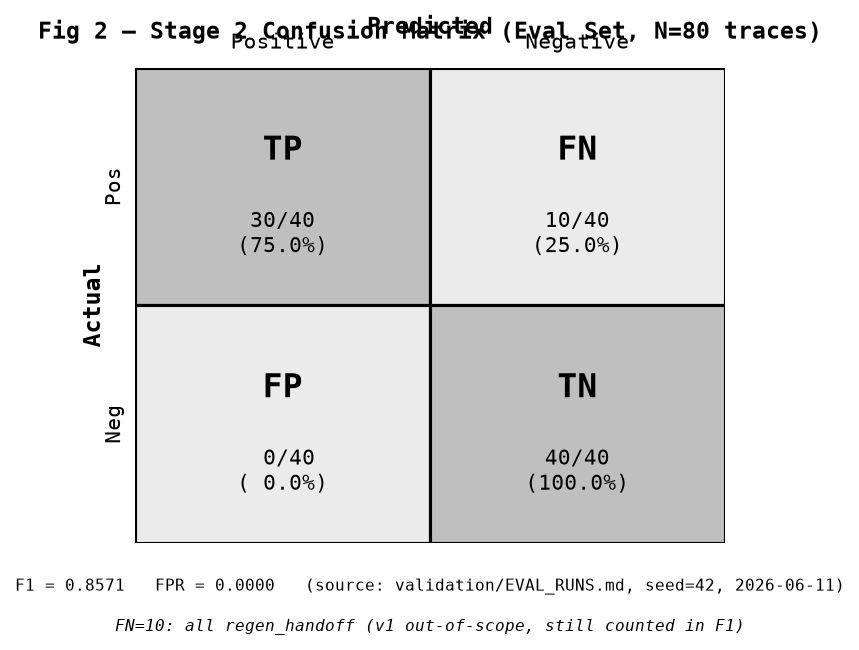
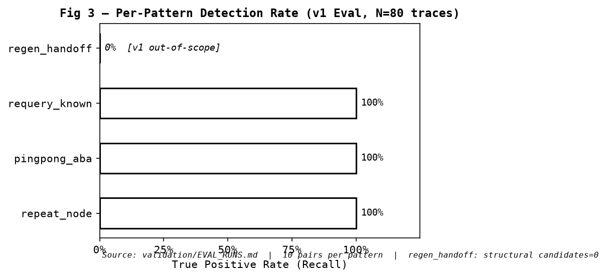
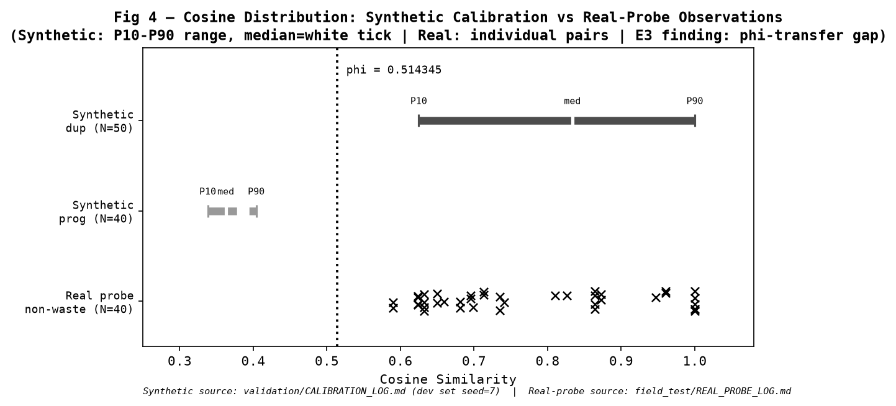

# 05 — Validation: Numbers, Provenance, Limits

> **Rule**: every number in this document was read directly from the artifact
> listed in the `<!-- src: ... -->` comment beside it. No values are carried
> from memory or other documentation.

---

## Frozen Parameters

<!-- src: src/clew/__main__.py:65-68 (confirmed identical in report/markdown.py:11-14
     and report/json_report.py:11-14 and validation/CRITERIA_FROZEN.md:22-24) -->

| Parameter | Value | Purpose |
|---|---|---|
| `phi` (φ) | `0.514345` | cosine similarity threshold for semantic duplicate gate |
| `N` | `2` | minimum repeat count to generate a structural candidate |
| Embedding model | `paraphrase-multilingual-MiniLM-L12-v2` | sentence-transformers model |
| Model revision | `e8f8c211226b894fcb81acc59f3b34ba3efd5f42` | frozen git commit SHA |

These values are hard-coded constants; they cannot be changed at runtime.
The calibration procedure that produced them is in `validation/CALIBRATION_LOG.md`.

---

## Git Tag Timeline (4 Confirmed Release Tags)

<!-- src: git tag -l --sort=creatordate -->

| Tag | Date | What was frozen |
|---|---|---|
| `ingest-hardening-v1` | 2026-06-13 | Preprocessing pipeline (4 stages) complete and tested. `preprocess_trace()` contract stabilised; router filter + token rollup active. |
| `report-cli-v1` | 2026-06-13 | CLI (`python -m clew analyze`) and both report renderers (markdown + JSON) functional end-to-end. |
| `real-probe-v1` | 2026-06-16 | Real-trace field test (5 scenarios, E1-E3) complete. All scenarios pass. E3 φ-transfer finding recorded. |
| `input-generalization-v1` | 2026-06-20 | Framework-agnostic OTel SDK JSON ingestion (Format A) added. `_load_trace_auto` format detection in place. 171 tests passing. |

Earlier tags for context:

| Tag | Date | What was frozen |
|---|---|---|
| `stage1-freeze` | 2026-06-06 | Labels (`eval/labels.jsonl`) and eval set manifest frozen. Success/kill criteria written and locked. |
| `stage2-detector-freeze` | 2026-06-11 | Detector and parameters frozen (φ, N, model+revision). |
| `stage2-eval-go` | 2026-06-11 | Official eval run completed → GO verdict. |

---

## Calibration Summary

<!-- src: validation/CALIBRATION_LOG.md -->

Calibration was run on the dev set (seed=7, separate from eval set) on
2026-06-07T09:31:05Z.

| Metric | Value | Pass threshold |
|---|---|---|
| Gap (P10 dup − P90 prog) | `0.220847` | > 0 |
| Cohen's d | `4.3803` | >= 0.5 |
| Pair-level dev FPR estimate | `0.0` | <= 0.15 |
| Trace-level cascade FPR (dev) | `0.0` | <= 0.10 |

Dev set cosine distributions:

| Group | Count | P10 | Median | P90 | Mean |
|---|---|---|---|---|---|
| Duplicate (dup) | 50 | 0.624768 | 0.833652 | 1.0 | 0.816025 |
| Progress (prog) | 40 | 0.338028 | 0.362569 | 0.403921 | 0.366772 |

φ = 0.514345 was placed at the midpoint of P10(dup) and P90(prog).

---

## Official Evaluation Result

<!-- src: validation/EVAL_RUNS.md (run 1, 2026-06-11) -->

Single official run. Gray-zone budget of N=3 re-runs was not consumed.

| Metric | Value |
|---|---|
| F1 (trace-level) | **0.8571** |
| FPR (control / negative traces) | **0.0000** |
| Verdict | **GO** |

Eval set: 80 traces, seed=42.
<!-- src: eval/set_manifest.json -->
Positive: 40 traces. Negative (clean): 40 traces. 4 patterns × 10 pairs each.

---

## Confusion Matrix

<!-- src: validation/EVAL_RUNS.md + validation/CRITERIA_FROZEN.md §Stage 2 results -->

```
                 Predicted Positive   Predicted Negative
Actual Positive       TP = 30              FN = 10
Actual Negative       FP =  0              TN = 40
```

**FN = 10 = all regen_handoff.**
`regen_handoff` was explicitly descoped from v1 (see §regen_handoff Decision below)
because the structural layer produces zero candidates for this pattern — so it never
reaches the semantic gate. Despite being out of scope, these 10 traces are **counted
as false negatives in the F1 calculation** above. F1 = 0.8571 includes this penalty.



---

## Per-Pattern Detection Rate

<!-- src: validation/CRITERIA_FROZEN.md §Stage 2 results: "in-scope 3 patterns 30/30=1.00, regen_handoff 0/10" -->

| Pattern | TP | Total | TPR | Status |
|---|---|---|---|---|
| repeat_node | 10 | 10 | **1.00** | in scope |
| pingpong_aba | 10 | 10 | **1.00** | in scope |
| requery_known | 10 | 10 | **1.00** | in scope |
| regen_handoff | 0 | 10 | **0.00** | v1 out-of-scope |
| **Overall** | 30 | 40 | **0.75** | |

The 0% for `regen_handoff` is not a bug — it is a deliberate scope decision.
See the §regen_handoff Decision section.



---

## regen_handoff v1 Decision

<!-- src: validation/CRITERIA_FROZEN.md §Stage 2 v1 scope decision -->

Diagnosis: `find_candidates()` produces zero structural candidates for
`regen_handoff` traces because the pattern is cross-node and each node appears
only once. Cosine between the two agents' outputs = 0.862 > φ, confirming this is
a structural miss, not a semantic miss. Making the semantic layer the sole detector
for this pattern would risk false positives on legitimate cross-node handoffs.

Decision: `regen_handoff` is explicitly out of scope for v1. The eval dataset
retains these traces and reports them transparently as uncovered (TPR = 0.00).

---

## Real-Probe Field Test: E1/E2 Results

<!-- src: field_test/REAL_PROBE_LOG.md -->

Date: 2026-06-16T06:25:03Z.
Topic: 'quantum computing basics'. Platform: Claude Haiku 3-node LangGraph.
Frozen params: PHI=0.514345, N=2, MODEL=paraphrase-multilingual-MiniLM-L12-v2.

| Scenario | Expectation | Result | Status |
|---|---|---|---|
| clean | E1: FP = 0 | no waste detected | **PASS** |
| repeat_node | E2: waste detected | 1 span flagged | **PASS** |
| requery_known | E2: waste detected | 1 span flagged | **PASS** |
| requery_clean | E2 negative: no detection | no waste detected | **PASS** |
| pingpong | E2: waste detected | 2 spans flagged | **PASS** |

All 5 scenarios pass (5/5). **FP = 0 across all scenarios.**

**Attribution of FP = 0:**
The clean and requery_clean scenarios produce FP = 0 because the **structural
layer** (`find_repeat_candidates`, `find_pingpong_candidates`) generates no
candidates for those traces — not because the semantic gate filtered them out.
This is an important distinction: FP = 0 here is evidence of correct structural
logic, not of the semantic layer's ability to separate waste from non-waste on
real data.

---

## E3 Finding: φ-Transfer Problem

<!-- src: field_test/REAL_PROBE_LOG.md §E3 finding record (2026-06-16) -->

Pre-registration predicted non-waste span-pair cosines would cluster at 0.48–0.57
on real traces (finding3). Actual observations:

| Scenario | Non-waste pairs (N) | Min cosine | Median | Max |
|---|---|---|---|---|
| clean | 6 | 0.6497 | 0.7350 | 1.0000 |
| repeat_node | 6 | 0.7129 | 0.8026 | 1.0000 |
| requery_known | 10 | 0.6320 | 0.6957 | 1.0000 |
| requery_clean | 15 | 0.5899 | 0.6810 | 1.0000 |
| pingpong | 3 | 0.6592 | 0.6986 | 0.9470 |

All 40 non-waste pairs across all 5 scenarios had cosine **above φ = 0.514345**.
The φ-transfer problem is thus stronger than predicted: the semantic gate
cannot distinguish waste from non-waste if the structural layer passes candidates,
because real non-waste outputs from the same topic share vocabulary and score above φ.

**Mitigation status:** φ is not adjusted post-data (that would be data fishing).
Semantic layer redesign requires 3–5 additional real traces from different
domains/languages before a new pre-registration experiment can be opened.



---

## Documented Limitations (v1)

<!-- src: docs/ARCHITECTURE.md §Part 3 -->

| # | Limitation | Detail |
|---|---|---|
| L1 | φ trained on synthetic only | φ = 0.514345 was selected on dev set (seed=7, synthetic traces). Transfer to real multi-domain traces is unverified. |
| L2 | F1 from synthetic eval set | F1 = 0.8571 was measured on 80 synthetically generated traces, not real system outputs. |
| L3 | regen_handoff gap | 10 of 80 eval traces (12.5%) are uncoverable by the v1 structural layer. |
| L4 | Cost calculation precision | `cost_rate` is a static per-token rate with no prompt/output token distinction. Real costs may differ. |
| L5 | Single-topic real traces | All 5 real-probe scenarios used one topic ('quantum computing basics'), one language (English), one platform. |

---

## Validation Integrity Guardrails

The codebase enforces 11 label-leakage guardrails verified by the test suite:
detection code in `src/clew/detect/` contains no imports of `eval/labels.jsonl`.
The eval runner (`eval/evaluate.py`) is the only file permitted to read labels,
and it runs after all detection code has produced its predictions.
